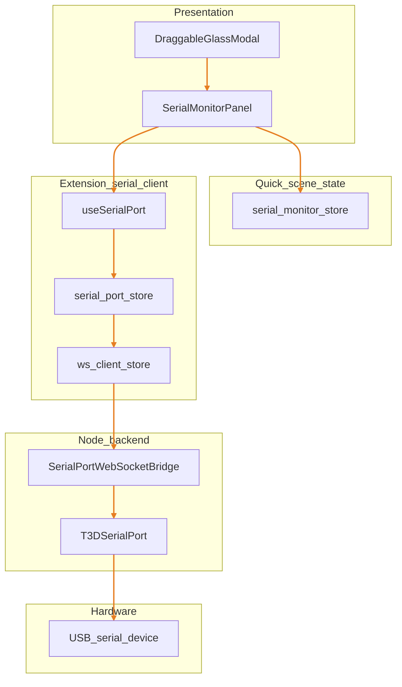
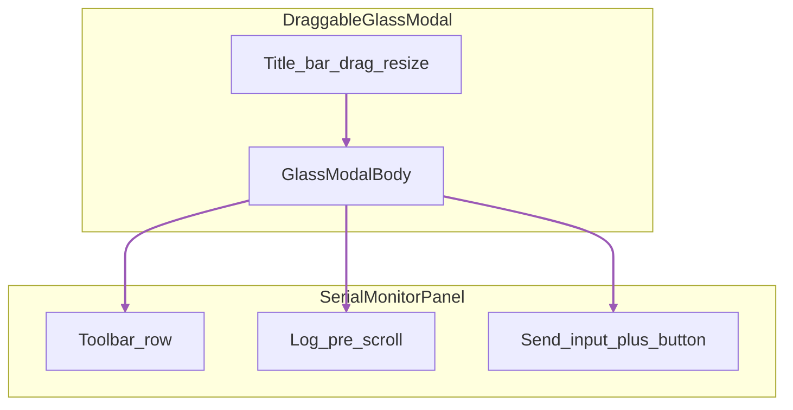
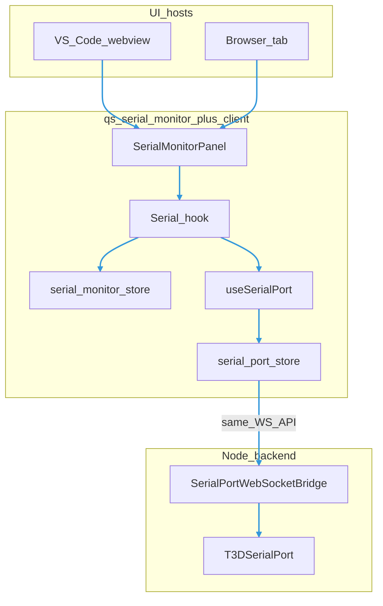
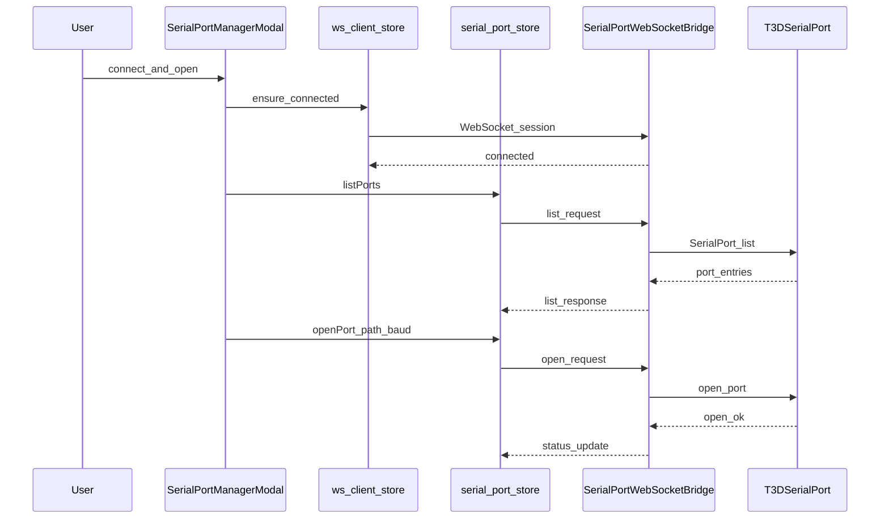
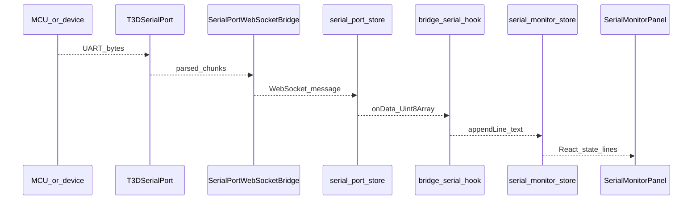
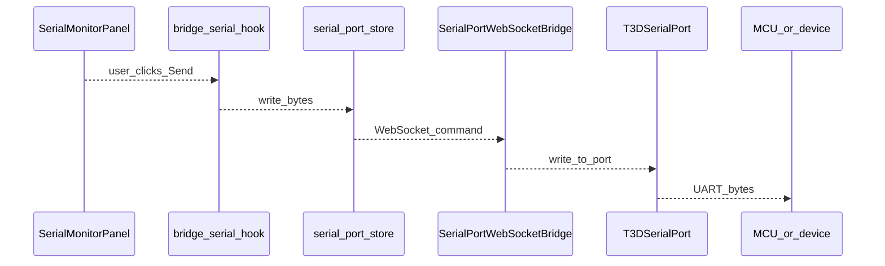

# Serial Monitor (quick scene)

Quick scene **`ext-serial-monitor`** — a draggable glass modal over the 3D view with a **toolbar**, **scrollable log**, and **send** row. Intended as a small serial terminal for MCU debugging.

## Architecture (authoritative)

- **No Web Serial** — the UI does not use `navigator.serial` or T3D `useWebSerial`. Serial access is **only** through the **backend** (Node `serialport` + [`serialport-bridge`](../../../serialport-bridge/SerialPortWebSocketBridge.ts)) and the shared webview client in **[`webview/serialport/`](../../serialport/)** (`useSerialPort`, `serial-port-store`, WebSocket protocol).
- **Browser and VS Code webview behave the same** — both run the same bundle and talk to the **same WebSocket API**; the only requirement is that a bridge process reachable at the configured **WS URL** is running (extension host, standalone `combined-bridge-entry`, or your deployment equivalent).

## Layer stack (who talks to what)

Top to bottom: **UI** (host agnostic) → **quick-scene state** (log buffer) → **extension serial client** (shared with other tools) → **Node bridge** → **USB device**.

## Registration

- Scene metadata and component: [`qs-serial-monitor.ts`](./qs-serial-monitor.ts) (`T3DQuickSceneInfo`, `applicationComponent: AppQsSerialMonitor`).
- Registered with the quick-scene catalog from [`main.tsx`](../../main.tsx) via `qsSerialMonitorQuickScenes` and `registerQuickScenes`.

## Layout (files)

| Path | Role |
|------|------|
| [`ui/AppQsSerialMonitor.tsx`](./ui/AppQsSerialMonitor.tsx) | Shell: `DraggableGlassModal` + `SerialMonitorPanel`. |
| [`ui/serial-data-viewer.tsx`](./ui/serial-data-viewer.tsx) | Read-only scrollable log; `lines` + `autoScroll`. |
| [`ui/SerialMonitorPanel.tsx`](./ui/SerialMonitorPanel.tsx) | Three-row body: compact toolbar (status, **Configure…**, clear log), `SerialDataViewer`, send. |
| [`serialport/serial-port-manager/`](../../serialport/serial-port-manager/) | **`SerialPortManagerModal`**: shared WS + port controls (`ConnectionBlock`); opened from Configure. |
| [`store/serial-monitor-store.ts`](./store/serial-monitor-store.ts) | Zustand: `lines`, `maxLines`, `baudRate`, `autoScroll`, append/clear, setters. |
| [`hooks/useSerialMonitor.ts`](./hooks/useSerialMonitor.ts) | Bridge hook: `useSerialPort("qs-serial-monitor", …)` + line decode into store. |
| [`store/index.ts`](./store/index.ts) | Store exports. |
| [`hooks/index.ts`](./hooks/index.ts) | Hook exports. |

## Modal layout (three rows)

The glass modal body is one column: **toolbar** (read-only status + **Configure…** opens the port manager, clear log), **log** (scrollable lines), **send** (input + button). **WS / list / open / port / baud** live in **`SerialPortManagerModal`** (second glass window).

## Data flow (target)

Same **React bundle** and **`webview/serialport`** client run in **VS Code webview** and in a **browser**; both use the same WebSocket protocol. Only **host** and **WS URL / bridge process** differ.

Incoming bytes from the bridge are decoded to **lines** (buffer partial lines), optionally stripped of VT100 escapes, then **`appendLine`**. Outgoing text uses **`write`** from `useSerialPort` / store (same as `SerialPortTester`).

### Sequence diagrams (control and data)

Flowcharts show *structure*; **sequence diagrams** show *order of messages*. The steps below are the same whether the UI runs in **VS Code webview** or a **browser** tab (same client, same bridge protocol).

#### Connect WebSocket and open port (summary)

Typical flow before streaming: ensure **WS** is up, **list** ports, **open** with path and baud. Exact message names live in [`serialport-bridge/protocol`](../../../serialport-bridge/protocol.ts); labels here are descriptive.

Sequence diagrams clarify **when** each step runs (connect before `onData`, `write` after port open). Use them together with the **Layer stack** diagram.

#### Read path (incoming bytes, streaming)

#### Send path (outgoing text)

## Related docs

- Implementation plan: [`PLAN.md`](./PLAN.md).
- Glass modal: [`draggable-glass-modal/DESIGN.md`](../../ui/components/draggable-glass-modal/DESIGN.md).
- Modal API: [`DraggableGlassModal.md`](../../ui/components/doc/DraggableGlassModal.md).
- Extension serial roadmap: [`DEVELOPMENT_PLAN.md`](../../../serialport/DEVELOPMENT_PLAN.md).

## Status

- **Bridge + log**: `useSerialMonitor` → `useSerialPort`, lines in `serial-monitor-store`, stream rendered by **`SerialDataViewer`**.
- **Toolbar**: Read-only status, **Configure…** (opens **`SerialPortManagerModal`** with full `ConnectionBlock`), Clear log; send row calls `write` when port is open.
