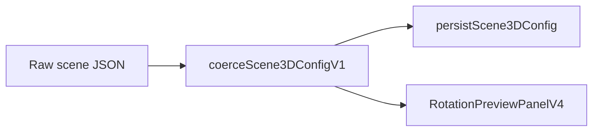

# Rotation preview scene configuration (`Scene3DConfigV1`)

This note describes the **JSON-shaped scene rig** used by the Sensor Studio **Rotation** node preview (Three.js runtime). It complements the Bitstream workspace math doc [`ROTATION_3D_PREVIEW.md`](../../bitstream-app/docs/ROTATION_3D_PREVIEW.md), which covers fusion frames and quaternion mapping; **this file** is the contract for **saved scene settings** (model URL, lights, camera, environment, shadows, helpers).

## Where it lives in code

| Artifact | Role |
|----------|------|
| [`scene3d-config.ts`](../features/editor/nodes/rotation/scene3d-config.ts) | Type definition, defaults (`DEFAULT_SCENE3D_CONFIG_V1`), coercion (`coerceScene3DConfigV1`), presets (`studioLightsFromPreset`), persistence helper (`persistScene3DConfig`). |
| [`RotationPreviewPanelV4.tsx`](../features/editor/nodes/rotation/RotationPreviewPanelV4.tsx) | Applies coerced config to renderer, orbit controls, lights, GLB root, environment, and framing. |
| [`rotation-preview-shadow-runtime.ts`](../features/editor/nodes/rotation/rotation-preview-shadow-runtime.ts) | Shadow pipeline helpers: resolved params, cache key, directional shadow camera, mesh cast/receive, subtree exclusion for helpers. |
| [`Rotation3DInspectorCards.tsx`](../features/editor/components/rotation/Rotation3DInspectorCards.tsx) | Inspector UI: Basic vs Advanced blocks, presets, JSON accordion, shadow and light tuning. |

## Default model URL (VS Code webview and VSIX)

The default **`model.url`** for new / coerced configs is **not** a Vite-bundled path under `out/webview/assets/models/**`. Those trees are often **excluded from the packaged VSIX** (see `.vscodeignore`), so URLs derived from `import.meta.url` would 404 in production.

Defaults and loader fallbacks use **`resolveDefaultPreviewMeshGlbUrl()`** from  
[`resolveWebviewModelAssetUrl.ts`](../../bitstream-app/components/3d-rotation/shared/resolveWebviewModelAssetUrl.ts) — the **same resolver** as the Bitstream rotation preview. It maps **`PSOC_E84_GLB_RELATIVE_PATH`** to **`FREE_ASSETS_BASE_URI`**, **`LOCAL_ASSETS_BASE_URI`**, online mirrors, and asset source strategy. Users must have the free pack synced (or online assets available) for the default PCB GLB to load in a VSIX install; see [Managing downloaded assets](../../../../docs/MANAGING_DOWNLOADED_ASSETS.md) and [Assets location system](../../../../docs/ASSETS_LOCATION_SYSTEM.md).

## Version and persistence

- **`version`**: Currently **`1`**. Coercion normalizes unknown shapes to a full `Scene3DConfigV1`.
- **`persistScene3DConfig(config)`**: Returns `coerceScene3DConfigV1(config)` so saved snapshots stay canonical (clamped numbers, valid enums, legacy keys upgraded — see below).

## Legacy lighting: `lights.directional` vs `lights.directionals`

Older saved graphs may store a single object at **`lights.directional`** (`colorHex`, `intensity`, `position`). **`coerceScene3DConfigV1`** maps that into a one-element **`lights.directionals`** array with id **`studio-main`**.

When **`lights.directionals`** is a non-empty array, it wins. Up to **`MAX_STUDIO_DIRECTIONALS` (8)** entries are kept; duplicate ids are deduplicated with suffixes.

## Multi studio directionals

Each **`StudioDirectionalLightV1`** has:

- **`id`**: Stable key for UI and optional directional helper attachment (`helpers.directionalLight.attachToDirectionalId`).
- **`colorHex`**, **`intensity`**, **`position`**: Ambient + directionals drive the studio rig; shadow casting is wired for these lights in the preview panel.

Named presets (**`studioLightsFromPreset`**) replace **`lights`** only (ambient + directionals): **`ibl-forward`**, **`key-fill`**, **`soft-studio`**.

## Embedded GLB rig policy (`model.embeddedRigPolicy`)

| Value | Behavior (conceptual) |
|-------|------------------------|
| **`keep`** | Use embedded GLTF lights and cameras as loaded where applicable. |
| **`strip`** | Remove embedded lights and cameras; studio rig only. |
| **`hybrid`** | Drop embedded cameras (orbit preview stays authoritative); keep embedded lights. |

Transforms under **`model.transform`** (position, rotation in degrees, scale) apply to the loaded model group in world space after policy handling.

## Environment

- **`presetIndex`**, **`showBackgroundTexture`**, **`useCubemapIbl`**, **`iblStrength`**, **`iblOffStrengthFrac`**, **`yawDeg`** (environment rotation around world Y), **`backgroundColorHex`**.
- Runtime ties IBL strength to `scene.environmentIntensity` when cubemap IBL is enabled.

## Renderer and shadows

Defaults mirror Bitstream-friendly tuning (ACES exposure, optional shadows off by default).

| Field | Meaning |
|-------|---------|
| **`shadowsEnabled`** | Toggles shadow maps from studio directionals. |
| **`shadowMapSize`** | Square map edge length; coerced to **512 / 1024 / 2048 / 4096**. |
| **`shadowOrthoExtent`** | Half-extent of the orthographic shadow frustum (± world units); clamped in coercion. |
| **`shadowBias`** | Depth bias (acne vs peter-pan trade-off). |
| **`shadowNormalBias`** | Normal offset for shadow sampling. |

**`resolveStudioShadowParams`** (shadow runtime) fills missing or non-finite values from **`DEFAULT_SCENE3D_CONFIG_V1.renderer`** so runtime matches coercion semantics.

Helper subtrees (grid, axes, gizmos) call **`disableShadowOnObjectSubtree`** so they do not appear in shadow maps. Loaded mesh subtrees use **`applyStudioShadowMeshes`** when shadows are enabled.

## Camera and orbit controls

- **`camera`**: FOV, framing margin/direction, near/far heuristics, explicit **`transform.position`** and **`transform.target`** for authored placement.
- **`controls`**: Full OrbitControls-style serialization (damping, pan/zoom/rotate, polar/azimuth limits, distances, mouse buttons, touches).

## Helpers

Grid, body axes, camera frustum helper, and directional helper plane — each block has **`enabled`** plus sizing/color fields. Directional helper **`attachToDirectionalId`** must match an existing directional **`id`** or is stored as **`null`**.

## Inspector layout (high level)

The rotation inspector groups **Basic** (model, environment essentials, framing) vs **Advanced** (full transforms, shadow numeric fields, controls JSON-adjacent sections). Scene JSON is editable via an accordion; **`persistScene3DConfig`** should run when saving node config so legacy keys do not linger.

## Data flow (coercion and preview)

Raw input from the node merges through coercion before the preview applies Three.js objects; persistence re-coerces so the on-disk shape stays stable.
