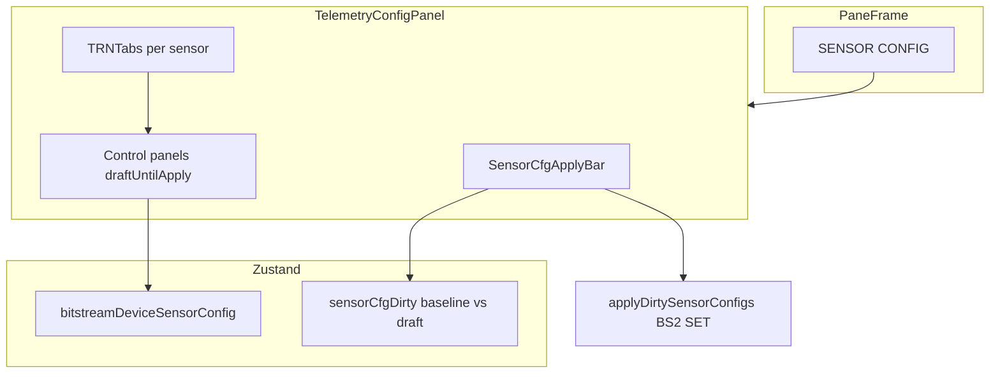

# Sensor Config pane improvement plan

**Date:** 2026-05-29  
**Scope:** Sensor Telemetry workbench — **Sensor Config** pane (`TelemetryConfigPanel`, `SensorCfgApplyBar`, `PaneFrame` header). Workbench panes (title case): **Sensor Config** · **3D Orientation** · **Telemetry Deck** · **Activity Log** (`telemetry-workbench-registry.tsx`).

## Current architecture

Default layout width: **~32%** of top row (`default-telemetry-workbench-layout.ts`).

---

## Improvement backlog (20 items)

| ID | Item | Priority | Phase | Status |
|----|------|----------|-------|--------|
| 1 | Unify BMI270 **output mode** + **fusion feed** with draft-until-Apply in Configuration pane | High | 2 | Done |
| 2 | Fix Apply bar hint — output mode is in **Operation** card, not toolbar | High | 1 | Done |
| 3 | Show **Apply pending** status in Apply bar (per-sensor label) | High | 1 | Done |
| 4 | **Specific lock reasons** (WS, COM, HELLO, cfg loading) | High | 1 | Done |
| 5 | **Dirty dot** on sensor tabs | High | 1 | Done |
| 6 | Per-sensor **Apply / Revert** | Medium | 4 | Planned |
| 7 | Dirty badge on **PaneFrame** header when cfg unsaved | Medium | 3 | Planned |
| 8 | **Persist selected sensor tab** (`localStorage`) | Medium | 3 | Planned |
| 9 | Persist **card order / collapsed** state per sensor | Medium | 4 | Planned |
| 10 | **Empty / loading** state per tab when row missing | Medium | 3 | Planned |
| 11 | **Activity log** on Refresh / Apply success and failure | High | 1 | Done |
| 12 | Expose **`applyAllSensorsAtHz`** bulk preset in pane | Medium | 4 | Planned |
| 13 | Link or embed read-only **DeviceSensorConfigSummary** | Medium | 4 | Planned |
| 14 | **Narrow-pane tab UX** (icons, vertical rail, or select) | Medium | 3 | Planned |
| 15 | Reduce Apply bar vertical density (sticky footer / collapsible hints) | Medium | 3 | Planned |
| 16 | DRY **`TelemetryConfigPanel`** — shared sensor tab wiring | Low | 5 | Planned |
| 17 | **Mask** field — document or expose if firmware supports | Low | 5 | Planned |
| 18 | **Unsaved navigation guard** (`beforeunload`, workspace switch) | Low | 5 | Planned |
| 19 | Keyboard shortcuts (Apply, Revert) | Low | 5 | Planned |
| 20 | **Sensor Studio parity** — `DeviceSensorSettingsWindow` vs draft mode | Low | 5 | Planned |

---

## Implementation phases

### Phase 1 — Quick polish (target: same session)

- #2 Hint copy correction  
- #3 Pending Apply feedback  
- #4 Lock reason helper + banner  
- #5 Tab dirty indicators  
- #11 Activity log for Refresh / Apply  

**Files:** `SensorCfgApplyBar.tsx`, `TelemetryConfigPanel.tsx`, new `lib/telemetryConfigPaneLockReason.ts`, `lib/sensorCfgApplyBarAck.ts`, `components/SensorCfgTabTrigger.tsx`.

### Phase 2 — Behavior clarity

- #1 Unify BMI270 **output mode** + **fusion feed** with draft-until-Apply in Configuration pane  
- `bmi270FirmwareExtrasDraft.store.ts` + `bmi270FirmwareExtrasSync.ts` + `Bmi270StreamModeSyncEffect` defer gate  
- Documented in **`SENSOR_DECK_VIEWER_CONVENTIONS.md`** §6.4  

**Status:** Done (2026-05-29)

### Phase 3 — Layout and discoverability

- #7 Pane header dirty badge (`telemetryWorkbenchUi.store` + `PaneFrame` or registry hook)  
- #8 Tab persistence  
- #10 Per-tab empty states  
- #14 Narrow-pane tab UX  
- #15 Apply bar density  

### Phase 4 — Power features

- #6 Per-sensor Apply / Revert  
- #12 Bulk Hz preset  
- #13 Device truth summary link  
- #9 Card order/collapse persistence  

### Phase 5 — Maintainability and edge cases

- #16–#20 DRY panel, mask, navigation guard, shortcuts, Sensor Studio parity  

---

## Testing checklist (per phase)

| Check | UART | Simulation |
|-------|------|------------|
| Lock banner matches WS / COM / HELLO / loading | ✓ | ✓ |
| Dirty dots on edited sensor tabs | ✓ | ✓ |
| Apply pending shows sensor name | ✓ | ✓ |
| Refresh / Apply lines in Activity pane | ✓ | ✓ |
| Draft + Apply round-trip unchanged | ✓ | ✓ |

---

## Related docs

- `bitstream-app/docs/BITSTREAM_SENSOR_DATA_FLOW_AND_STATE.md` — cfg store and cold sync  
- `bitstream-app/docs/CONTROL_PANEL_MULTI_INSTANCE_SYNC.md` — broker fan-out  
- `src/bitstream2/docs/SENSOR_CFG_V2.md` — wire format  
