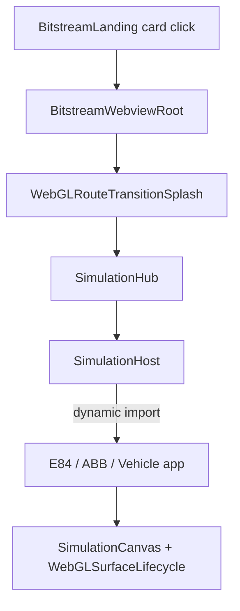

# Digital Twin simulations (webview)

Isolated, self-contained 3D simulation apps ported from `ternion-t3d` without `@ternion/t3d`.

## Rules

- **No imports** between `e84-rotation/`, `abb-robot/`, `vehicle-physics/`, and `physics-lab/`.
- **No imports** from `sensor-studio/` or `bitstream-app/` state (BS2, telemetry, workspace).
- Use **`shared/`** only for generic shell, canvas, and thin asset/MQTT helpers.
- Use **`catalog/`** for metadata and `import()` loaders only.
- Each app exports one root component from **`index.ts`**.

Full migration plan: [`../../../docs/APPLICATION_MIGRATION_PLAN.md`](../../../docs/APPLICATION_MIGRATION_PLAN.md).

## Hub flow

| Module | Role |
|--------|------|
| `SimulationHub.tsx` | Eager `SimulationHost` (**not** `lazy()` — caused React #321) |
| `SimulationHost.tsx` | `loadSimulationApp(id)` + deferred Canvas mount via `useWebGLSurfaceReady` |
| `simulationHub.store.ts` | `activeSimulationId`, URL sync (`?sim=`) |
| `catalog/simulationCatalog.ts` | Metadata + per-sim `import()` |

## Simulations

| Id | Status | Notes |
|----|--------|-------|
| `e84-rotation` | MVP | GLB rotation, MQTT panel, transform controls |
| `abb-robot` | MVP | Arm controller, GSAP, MQTT |
| `vehicle-physics` | Partial | Jolt four-wheel, config panel, driving keys |
| `physics-lab` | **P2** | + gizmo, ortho/persp (**5**), authoring modes, scene JSON, outliner reorder — [`PHYSICS_LAB.md`](./physics-lab/docs/PHYSICS_LAB.md) |

## WebGL / build (required reading)

See **`../shared/webgl/README.md`**.

- **`SimulationCanvas.tsx`** — shared R3F wrapper; includes `WebGLSurfaceLifecycle`.
- **`vite.config.ts`** — `manualChunks` → `vendor-react`, `vendor-r3f`.
- R3F scenes using `useFrame` / `useThree`: add **`"use no memo"`** at file top (React Compiler).

## Back to landing

Toolbar / sim **Back** → `returnToWorkspaceLanding()` in `landing/bitstreamLandingActions.ts` (closes sim, opens landing store).
