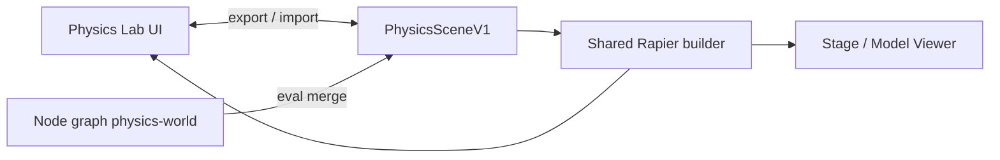

# Physics Lab — product and architecture

**Status:** Planned (not shipped)  
**Id:** `physics-lab` · dev URL `?sim=physics-lab`  
**Engine:** Rapier (`@react-three/rapier` + `@dimforge/rapier3d-compat`)  
**Schema:** [`extension/docs/PHYSICS_SCENE_V1.md`](../../../../../docs/PHYSICS_SCENE_V1.md)  
**GLB authoring:** [`../../vehicle-physics/docs/VEHICLE_GLB_AUTHORING.md`](../../vehicle-physics/docs/VEHICLE_GLB_AUTHORING.md)  
**Reference implementation:** [`REFERENCE_3D_PHYSICS_ENGINE.md`](./REFERENCE_3D_PHYSICS_ENGINE.md) — external repo `D:\CODE\2026\3DPhysicsEngine` (`collision-engine`)  
**Factories (sub-editors):** [`PHYSICS_LAB_FACTORIES.md`](./PHYSICS_LAB_FACTORIES.md) — Car, Drone, Robot arm, Environment, Primitive  
**Scene editor UX:** [`PHYSICS_LAB_SCENE_EDITOR.md`](./PHYSICS_LAB_SCENE_EDITOR.md) — outliner, hierarchy DnD, multi/box select, highlights  
**Professional catalog:** [`PHYSICS_LAB_PROFESSIONAL_FEATURES.md`](./PHYSICS_LAB_PROFESSIONAL_FEATURES.md) — authoring modes, collision matrix, collider editor, validation, phases P0–P8

## Vision

Physics Lab is a **professional game-engine-style physics editor** inside the Digital Twin simulation hub:

- Author **worlds** interactively (outliner, authoring modes, gizmo, collision layers, compound colliders, joints).
- Use **full Rapier rigid-body features** (primitives, compounds, convex hull, VHACD, static trimesh, sensors, materials, CCD).
- **Validate before simulate** — issue panel, auto-repair, debug overlays (contacts, COM, layer tints).
- **Round-trip** with the Sensor Studio **node graph** — objects created in the Lab are the **same data** the graph runs on Stage / Model Viewer.

Full feature checklist: [`PHYSICS_LAB_PROFESSIONAL_FEATURES.md`](./PHYSICS_LAB_PROFESSIONAL_FEATURES.md).

Physics Lab is **not** a throwaway sandbox. It is the **authoring surface** for the same `PhysicsSceneV1` document the `physics-world` node evaluates.



---

## Factories (sub-editors)

Physics Lab is **one app** with a shared core and multiple **factories** — focused authoring modes for different physics object types. Each factory adds presets, import rules, and inspector fields; all output **`PhysicsSceneV1`** for graph export.

| Factory | Role |
|---------|------|
| **Primitive** | Default — generic rigid bodies, colliders, joints, spawners |
| **Car** | `car_colliders.glb`, wheel layout, compound chassis (Rapier); link to Jolt **vehicle-physics** for full drive |
| **Drone** | Quadcopter thrusters + hover assist |
| **Robot arm** | Revolute joint chains |
| **Environment** | Static floor / trimesh, wind, buoyancy (later) |

Factory switcher in toolbar; specialized left panel per factory. Full spec: [`PHYSICS_LAB_FACTORIES.md`](./PHYSICS_LAB_FACTORIES.md).

---

## Game-engine parity (requirements)

Treat these as **non-negotiable** for “full functions,” phased in order.

### World

| Feature | Lab UI | Graph |
|---------|--------|-------|
| Gravity vector | Inspector / world panel | `physics-world` config |
| Play / pause / step | Toolbar | Simulate vs Edit on Stage |
| Fixed timestep | Advanced settings | `timestepHz` in scene |
| Debug draw (colliders, COM, contacts) | Toggle chips | Debug flag on physics-world |

### Bodies

| Feature | Lab | Graph node |
|---------|-----|------------|
| Fixed / dynamic / kinematic | Body inspector | `rigid-body` + motion type |
| Mass, damping | Inspector | `rigid-body` config |
| Transform (pose) | Gizmo + numeric | position / rotation on nodes |
| Compound (multiple colliders) | “Add collider to body” | `collider-group` (future) or multiple wired shapes |

### Colliders

| Shape | Lab spawn | Graph |
|-------|-----------|-------|
| Box | ✓ | `box-collider` |
| Sphere | ✓ | `sphere-collider` |
| Capsule | ✓ | `capsule-collider` (future) |
| Cylinder | ✓ | `cylinder-collider` (future) |
| Convex hull | From mesh / GLB collider | `glb-physics-body` (future) |
| Trimesh (static) | From mesh / floor GLB | static mesh collider node (future) |
| Friction / restitution | Material inspector | per-body / per-collider config |
| Sensor (trigger) | Toggle | sensor flag on collider |

### Joints

| Kind | Lab | Graph |
|------|-----|-------|
| Fixed | Connect two bodies | `fixed-joint` |
| Revolute (hinge) | Connect + axis | `hinge-joint` |
| Prismatic / spring | Phase 2+ | future nodes |

### Spawning

| Feature | Lab | Graph |
|---------|-----|-------|
| Rate spawner | “Rain” preset | `object-spawner` |
| One-shot drop at raycast hit | Click to spawn | — |

### Assets

| Feature | Lab | Graph |
|---------|-----|-------|
| GLB vehicle (`car_colliders.glb`) | Import preset | model URL + physics import node |
| Arena floor (trimesh) | Load static GLB | wired static collider |

---

## Viewport and scene editor

Full spec: [`PHYSICS_LAB_SCENE_EDITOR.md`](./PHYSICS_LAB_SCENE_EDITOR.md).

Reuse **Course Studio 3D Scene** navigation and selection — do not invent a second model.

| Capability | Reference |
|------------|-----------|
| Orbit / pan / zoom | Alt+LMB, Alt+Shift+LMB, scroll — `SCENE_3D_EDITOR.md` |
| Gizmo G / R / S | `TransformControls` — multi-selection moves all selected |
| Raycast pick + **Shift+click** multi | Course / Stage pick pattern |
| **Shift+drag** box select | `CourseSceneEditorViewport` marquee |
| Outliner tree + **DnD reparent** | `CourseSceneOutliner`, `scene3dHierarchyOps.ts` |
| **Ctrl+G** group · **Ctrl+P** parent | `CourseSceneParentMenu.tsx` |
| Perspective ↔ orthographic (**5**) | `VIEWPORT_PROJECTION_TOGGLE.md` |
| Frame selection (**.**) | Stage / Course |
| **Edit \| Simulate** | Pause Rapier while editing transforms |
| Selection highlights + wireframe | `diagram3dSelectionAppearance.ts` |

### Physics-specific

- **Pick layer:** Visual \| Collider \| Both.
- **Collider wireframe** on selected bodies; COM / joint / contact debug overlays.
- **Scene graph** in outliner: groups, bodies, collider children (see `PhysicsSceneNodeV1` in schema).

Long-term: shared modules under `webview/shared/viewport/`.

---

## Node graph integration

### Single schema

All Lab objects serialize to **`PhysicsSceneV1`** ([spec](../../../../../docs/PHYSICS_SCENE_V1.md)).

### Export Lab → graph

1. User builds scene in Physics Lab.
2. **Export to graph** creates (or updates):
   - one `physics-world` node,
   - collider / rigid-body / joint / spawner nodes,
   - wires into Scene Output **Physics** (when `phys` port ships).
3. Stable `id` / `sourceNodeId` preserved for re-import.

### Open graph → Lab

1. From Sensor Studio: **Open in Physics Lab** on selected `physics-world` subgraph.
2. Lab loads evaluated `PhysicsSceneV1` for interactive editing.
3. On save: push changes back to node `defaultConfig` (undoable in flow editor).

### Runtime

Both Lab and Stage call the same function:

```text
buildRapierWorldFromPhysicsSceneV1(scene) → step → sync meshes
```

No duplicate Rapier logic in `physics-lab/` vs `sensor-studio/`. Shared code lives in `webview/shared/physics/` (to be created).

---

## Isolation rules (simulations hub)

| Allowed | Forbidden |
|---------|-----------|
| `simulations/shared/**` | `physics-lab` → `sensor-studio` imports |
| `webview/shared/physics/**` (future) | `sensor-studio` → `physics-lab` imports |
| `catalog/simulationCatalog.ts` registration | Copy-paste Rapier step loop in two places |
| Asset URL helpers from bitstream-app | Jolt from `vehicle-physics` (separate engine) |

**Vehicle driving** stays in **vehicle-physics** (Jolt). Physics Lab may **import** `car_colliders.glb` as a **Rapier rigid-body preset**, not as a Jolt vehicle.

---

## UI layout (target)

```
┌──────────────────────────────────────────────────────────────────┐
│ ← Back   [Factory▼] [Object|Collider|Joint|Sim]  Edit|Sim  ▶ ⏸ Step │
├──────────┬─────────────────────────────────────────┬───────────────┤
│ Factory  │                                         │ Inspector     │
│ panel    │              3D viewport                │ World         │
│ Outliner │    pick · box select · gizmo · wire    │ Body          │
│ (tree)   │                                         │ Collider[s]   │
│          │                                         │ Joint         │
├──────────┴─────────────────────────────────────────┴───────────────┤
│ Export to graph · Open preset · Debug: colliders COM contacts      │
└──────────────────────────────────────────────────────────────────┘
```

**Outliner** — searchable tree; drag reorder; drop to reparent; visibility / pick lock icons.

---

## Phased delivery

Canonical roadmap: [`PHYSICS_LAB_PROFESSIONAL_FEATURES.md` § Implementation phases](./PHYSICS_LAB_PROFESSIONAL_FEATURES.md#implementation-phases-professional-roadmap).

| Phase | Deliverable |
|-------|-------------|
| **P0** | Boot — catalog, canvas, floor, box, Edit/Simulate, flat outliner, Play/Pause |
| **P1** | Editor core — multi/box select, undo/redo, wireframes, spawn palette, validation (read) |
| **P2** | Scene graph — tree DnD, gizmo, ortho/persp, `nodes[]`, save/load, **authoring modes Object/Collider** |
| **P3** | Colliders — compound editor, hull/trimesh, VHACD, materials, sensors, scale-bake |
| **P4** | **Collision layers + matrix UI**, collections, snap, prefabs, hide/lock |
| **P5** | Joints, **Joint mode**, CCD, full debug overlays |
| **P6** | Graph export/import, shared `buildRapierWorldFromPhysicsSceneV1`, Stage parity |
| **P7** | Factories — Car GLB, Drone, validation repair, factory debug HUDs |
| **P8** | Studio — Environment, telemetry, measure/align, isolation, shortcuts overlay |

---

## Catalog card (draft)

| Field | Value |
|-------|-------|
| **Title** | Physics Lab |
| **Subtitle** | Rapier · layers · compounds · graph |
| **Description** | Professional rigid-body editor — outliner, authoring modes, collision matrix, compound colliders, validation. Export to the Sensor Studio node graph. |
| **Tags** | Physics, Rapier, Colliders, Layers, Graph |
| **Icon** | `FlaskConical` or `Atom` |

---

## Testing matrix

| Case | Lab | Graph → Stage |
|------|-----|----------------|
| Box on floor settles | ✓ | Same `PhysicsSceneV1` JSON |
| Compound car GLB colliders | ✓ | Import node + eval |
| Hinge joint swing | ✓ | `hinge-joint` wire |
| Export → re-open in Lab | Round-trip ids stable | ✓ |
| Dev + VSIX | Same Rapier wasm chunk | ✓ |

---

## Reference implementation (3DPhysicsEngine)

Use **`D:\CODE\2026\3DPhysicsEngine`** as the primary **game-engine authoring** guideline. That repo already implements Rapier compounds, mesh/VHACD colliders, joints, play validation, gizmo picking, and command-based undo on a Godot-style scene graph (`SceneDoc` v2).

Bitstream **does not** replace `PhysicsSceneV1` with `SceneDoc`. Port **`src/core/physics/`** and GLTF/collider modules into `webview/shared/physics/`, reimplement viewport on **R3F**, and add **graph round-trip** + **spawners** + **ortho camera**.

Full borrow matrix: [`REFERENCE_3D_PHYSICS_ENGINE.md`](./REFERENCE_3D_PHYSICS_ENGINE.md).

---

## Related documents

| Doc | Role |
|-----|------|
| [`REFERENCE_3D_PHYSICS_ENGINE.md`](./REFERENCE_3D_PHYSICS_ENGINE.md) | What to port from `3DPhysicsEngine` |
| [`PHYSICS_SCENE_V1.md`](../../../../../docs/PHYSICS_SCENE_V1.md) | Portable scene schema |
| [`TIER_D_PHYSICS_FOUNDATION.md`](../../../sensor-studio/docs/TIER_D_PHYSICS_FOUNDATION.md) | Graph physics roadmap |
| [`PHYSICS_LAB_PROFESSIONAL_FEATURES.md`](./PHYSICS_LAB_PROFESSIONAL_FEATURES.md) | Full professional catalog (P0–P8) |
| [`PHYSICS_LAB_SCENE_EDITOR.md`](./PHYSICS_LAB_SCENE_EDITOR.md) | Outliner, selection, hierarchy |
| [`SCENE_3D_EDITOR.md`](../../../course-studio/docs/SCENE_3D_EDITOR.md) | Viewport UX reference |
| [`VIEWPORT_PROJECTION_TOGGLE.md`](../../../../../docs/VIEWPORT_PROJECTION_TOGGLE.md) | Ortho/persp math |
| [`VEHICLE_GLB_AUTHORING.md`](../../vehicle-physics/docs/VEHICLE_GLB_AUTHORING.md) | Artist GLB naming |

---

## Changelog

| Date | Change |
|------|--------|
| 2026-06-11 | Initial plan — game-engine scope, Rapier, graph round-trip |
