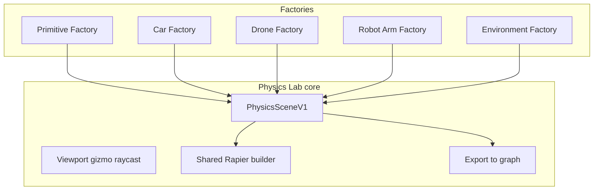

# Physics Lab — factories (sub-editors)

**Status:** Design  
**Parent:** [`PHYSICS_LAB.md`](./PHYSICS_LAB.md)  
**Schema:** [`PHYSICS_SCENE_V1.md`](../../../../../docs/PHYSICS_SCENE_V1.md)  
**Reference presets:** `D:\CODE\2026\3DPhysicsEngine\src\core\scene\presets.ts`

## Idea

Physics Lab is one app with a **shared core** (viewport, Rapier, `PhysicsSceneV1`, graph export) and multiple **factories** — focused sub-editors for different physics object families.

Each factory is a **template + tooling + validation + graph export** package, not a separate physics engine.



---

## Core vs factory

| Layer | Responsibility |
|-------|----------------|
| **Core** | World settings, Edit/Simulate, pick, gizmo, ortho/persp, hierarchy, undo, save/load JSON, export to graph |
| **Factory** | Domain presets, specialized spawn/import, inspector extensions, validation rules, GLB conventions, optional **mechanisms** block on scene |

All factories write the **same** `PhysicsSceneV1` file. Factory-specific data lives in:

- `PhysicsSceneV1.factory?: { kind, templateId, version }`
- `PhysicsSceneV1.mechanisms?: PhysicsMechanismV1[]` (vehicles, thrusters, etc.)
- Body-level `tags` / `factoryRole` (e.g. `wheel_fl`, `chassis`)

The **node graph** still evaluates to `PhysicsSceneV1`; factories may export **subgraph templates** (bundled nodes) tagged by `factory.kind`.

---

## Factory catalog (planned)

| Factory | Id | Purpose | Reference |
|---------|-----|---------|-----------|
| **Primitive** | `primitive` | Boxes, spheres, compounds, joints, spawners — generic Rapier | Default Lab mode |
| **Car** | `car` | Wheeled vehicle: GLB + compound colliders, optional Rapier raycast controller | `car_colliders.glb`, `VEHICLE_GLB_AUTHORING.md`, 3DPhysicsEngine `makeVehicleComponent` |
| **Drone** | `drone` | Quadcopter: thruster actuators, hover assist, rotor layout | 3DPhysicsEngine `makeQuadcopterThrusters` |
| **Robot arm** | `robot-arm` | Revolute chain, joint limits, motors | 3DPhysicsEngine `makeRobotArmJoints` |
| **Environment** | `environment` | Static floor, trimesh terrain, wind/water fields, buoyancy | 3DPhysicsEngine force-field / buoyancy components |

Add factories without forking the app — register in `physics-lab/factories/registry.ts`.

---

## Car Factory

### Scope

- Import **`car_colliders.glb`** (or future car GLBs) using [`VEHICLE_GLB_AUTHORING.md`](../../vehicle-physics/docs/VEHICLE_GLB_AUTHORING.md).
- Map `car_body` + `wheel_*` + `*_collider` → bodies / compound colliders.
- Inspector: wheelbase, track, mass, friction; per-wheel collider offset.
- **Two simulation modes** (user picks):
  1. **Rigid compound** — chassis + 4 wheel bodies + joints (simple push/drop tests).
  2. **Raycast vehicle** (Rapier) — optional; reference `3DPhysicsEngine` `VehicleComponent` — for Lab/Stage only.

### Out of scope for Car Factory

- **Jolt drive + camera** — stays in simulation hub **`vehicle-physics`**. Link: “Open in Vehicle Sim” when user needs full driving.

### Graph export

Spawns subgraph template, e.g.:

- `physics-world`
- `glb-physics-car` (future) or decomposed `rigid-body` + `box-collider` / `cylinder-collider` per part
- wires → Scene Output **Physics**

`factory: { kind: "car", templateId: "car_colliders.v1" }`

---

## Drone Factory

### Scope

- Quad layout preset (4 thrusters + central body).
- `PhysicsMechanismV1` kind `thruster` / `quadcopter` with channels (`thrust.vertical`, pitch/roll/yaw mix).
- Inspector: thrust per motor, hover assist, arm length.
- Optional GLB for frame + prop meshes (visual only; colliders = box/hull).

### Graph export

- Body nodes + actuator metadata on scene `mechanisms[]`
- Future graph node: `drone-actuator-bundle` (hidden catalog until D4+)

Reference: `makeQuadcopterThrusters()` in 3DPhysicsEngine.

---

## Robot Arm Factory

### Scope

- Spawn N links + N−1 revolute joints in a chain.
- Inspector: joint limits, motor targets, anchor offsets.
- Pick + gizmo per link.

### Graph export

- `rigid-body` chain + `hinge-joint` nodes wired in sequence.

Reference: `makeRobotArmJoints()` in 3DPhysicsEngine.

---

## Environment Factory

### Scope

- Static floor (box or trimesh GLB).
- Optional wind / water current regions (static or kinematic triggers).
- Buoyancy volume for floating bodies (pairs with Primitive or Car).

Lower priority than Car / Drone; mechanisms extension on `PhysicsSceneV1`.

---

## Primitive Factory (default)

Always available when no specialized factory is selected.

- Full generic collider/body/joint/spawner tooling.
- No `mechanisms` required.
- Closest to “blank” 3DPhysicsEngine scene without vehicle/drone components.

---

## UI: factory switcher

```
┌─────────────────────────────────────────────────────────────┐
│ Physics Lab  [Factory: Car ▼]  [Primitive|Car|Drone|…]     │
├──────────┬──────────────────────────────┬───────────────────┤
│ Factory  │                              │ Inspector         │
│ panel    │         Viewport             │ (factory-aware)   │
│          │                              │                   │
│ · Import │                              │ Car: wheel layout │
│   GLB    │                              │ Drone: thrust mix │
│ · Presets│                              │ Primitive: mass   │
└──────────┴──────────────────────────────┴───────────────────┘
```

- Switching factory **does not** clear the scene unless user confirms (mixed scenes allowed: car + floor from Environment).
- Factory panel shows only actions valid for active factory; core hierarchy shows all bodies.

---

## Code layout (target)

```
physics-lab/
  PhysicsLabApp.tsx
  core/                    # viewport, store, export — shared
  factories/
    registry.ts            # list + active factory id
    primitive/
      PrimitiveFactoryPanel.tsx
      presets.ts
    car/
      CarFactoryPanel.tsx
      importCarGlbPhysics.ts
      carSceneTemplate.ts
    drone/
      DroneFactoryPanel.tsx
      quadcopterTemplate.ts
    robot-arm/
    environment/
  docs/
    PHYSICS_LAB_FACTORIES.md
```

**Isolation:** factories depend on `core/` and `webview/shared/physics/` only — not on each other.

---

## Schema extension (`PhysicsSceneV1`)

```ts
type PhysicsFactoryMetaV1 = {
  kind: "primitive" | "car" | "drone" | "robot-arm" | "environment";
  templateId?: string;       // e.g. "car_colliders.v1"
  templateVersion?: number;
};

type PhysicsMechanismV1 =
  | { kind: "rapierVehicle"; wheels: /* ... */; drive: /* ... */ }
  | { kind: "quadcopter"; thrusters: /* ... */; assist: /* ... */ }
  | { kind: "forceField"; /* ... */ }
  | { kind: "buoyancy"; /* ... */ };

// On PhysicsSceneV1:
factory?: PhysicsFactoryMetaV1;
mechanisms?: PhysicsMechanismV1[];
```

Generic graph eval **ignores** `mechanisms` until Stage/Lab runtime registers handlers. Bodies/colliders/joints remain the portable minimum.

---

## Phasing

| Phase | Factory |
|-------|---------|
| P0–P1 | **Primitive** only (prove core) |
| P2–P3 | **Car** — `car_colliders.glb`, compound colliders |
| P4 | **Drone** — thruster mechanisms |
| P5 | **Robot arm** — joint chains |
| P6 | **Environment** — trimesh floor, fields |

---

## Changelog

| Date | Change |
|------|--------|
| 2026-06-11 | Initial factory architecture (Car, Drone, Robot arm, Environment, Primitive) |
