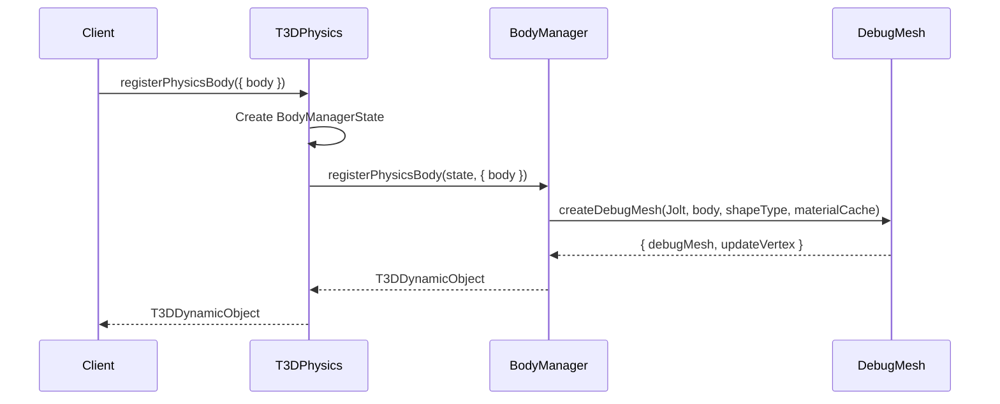

# Architecture Overview

## Purpose

This document provides an overview of the modular architecture of the T3DPhysics core modules, explaining the design principles, module organization, and how the modules interact with the main `T3DPhysics` facade class.

## Modular Design Principles

The refactoring of `T3DPhysics.ts` into separate modules follows several key design principles:

### 1. Single Responsibility Principle

Each module has a single, well-defined responsibility:

- **T3DPhysicsConfig**: Configuration constants and static methods only
- **T3DPhysicsInitializer**: Physics system initialization logic
- **T3DPhysicsBodyManager**: Body lifecycle management (registration, removal)
- **T3DPhysicsDebugMesh**: Debug visualization mesh creation
- **T3DPhysicsShapeMesh**: Shape-to-geometry conversion
- **T3DPhysicsBodyFactory**: Factory methods for creating common body types
- **T3DPhysicsUpdate**: Physics simulation update loop
- **T3DPhysicsUtils**: Pure utility functions

### 2. Separation of Concerns

Related functionality is grouped together, and unrelated concerns are separated:

- Initialization logic is separate from update logic
- Debug visualization is separate from body management
- Factory methods are separate from core body operations
- Utilities are pure functions with no dependencies

### 3. Dependency Management

Modules have clear, minimal dependencies:

- Lower-level modules (Config, Utils) have no dependencies on other core modules
- Higher-level modules depend on lower-level ones
- The main `T3DPhysics` class depends on all modules and coordinates them

### 4. Backward Compatibility

The modular architecture maintains 100% backward compatibility:

- The `T3DPhysics` class public API remains unchanged
- All existing code continues to work without modification
- Modules are implementation details hidden behind the facade

## Module Organization

The modules are organized in a hierarchical structure based on their dependencies:

```
T3DPhysics (facade)
├── T3DPhysicsConfig (no dependencies)
├── T3DPhysicsUtils (no dependencies)
├── T3DPhysicsInitializer
│   └── depends on: T3DPhysicsConfig
├── T3DPhysicsShapeMesh (standalone)
├── T3DPhysicsDebugMesh
│   ├── depends on: T3DPhysicsConfig
│   ├── depends on: T3DPhysicsShapeMesh
│   └── depends on: T3DPhysicsUtils
├── T3DPhysicsBodyManager
│   └── depends on: T3DPhysicsDebugMesh
├── T3DPhysicsUpdate
│   ├── depends on: T3DPhysicsBodyManager
│   ├── depends on: T3DPhysicsUtils
│   └── depends on: T3DPhysicsShapeMesh
└── T3DPhysicsBodyFactory
    ├── depends on: T3DPhysicsBodyManager
    └── depends on: T3DPhysicsUtils
```

## State Management Pattern

The modules use a **state object pattern** where functions receive state objects containing the necessary data:

### State Interfaces

Each module defines interfaces for the state it needs:

- `PhysicsInitState`: Initialization state
- `BodyManagerState`: Body management state
- `UpdateState`: Update loop state
- `BodyFactoryState`: Factory state (extends BodyManagerState)

### State Passing

The main `T3DPhysics` class owns all state and passes it to module functions:

```typescript
// Example: Update loop
const updateState: UpdateState = {
  Jolt: this.Jolt,
  joltInterface: this.joltInterface,
  dynamicObjects: this.dynamicObjects,
  frameCount: this.frameCount,
  accumulatedTime: this.accumulatedTime,
  disposed: this.disposed,
  initialized: this.initialized,
  paused: this.paused,
};
updatePhysics(updateState, deltaTimeSeconds);
```

This pattern ensures:

- Modules don't maintain their own state
- State is centralized in the main class
- Modules can be easily tested with mock state
- Clear ownership of state

## Module Interaction with T3DPhysics Facade

The `T3DPhysics` class acts as a facade that:

1. **Maintains State**: Owns all instance variables and state
2. **Delegates Operations**: Calls module functions with appropriate state
3. **Provides Public API**: Exposes the same public interface as before
4. **Coordinates Modules**: Orchestrates interactions between modules

### Example: Body Registration Flow



## Benefits of Modular Architecture

### 1. Maintainability

- Smaller, focused files are easier to understand
- Changes to one aspect don't affect unrelated code
- Clear separation makes debugging easier

### 2. Testability

- Modules can be tested independently
- Pure functions are easy to unit test
- State objects can be mocked for testing

### 3. Reusability

- Utility functions can be reused across modules
- Modules can be used independently if needed
- Clear interfaces make integration easier

### 4. Scalability

- New functionality can be added as new modules
- Existing modules can be enhanced without affecting others
- Clear dependencies prevent circular dependencies

### 5. Code Clarity

- Each file has a clear purpose
- Related code is grouped together
- Easier for new developers to understand

## Module Communication Patterns

Modules communicate in two ways:

### 1. Function Calls

Most communication happens through function calls:

```typescript
// BodyManager calls DebugMesh functions
import { createDebugMesh } from './T3DPhysicsDebugMesh';
const result = createDebugMesh(Jolt, body, shapeType, materialCache);
```

### 2. State Objects

State is passed as parameters:

```typescript
// T3DPhysics passes state to Update module
const updateState: UpdateState = { /* state */ };
updatePhysics(updateState, deltaTimeSeconds);
```

## Module Exports

Each module exports:

- **Functions**: Pure functions or functions that operate on state
- **Interfaces/Types**: Type definitions for state and parameters
- **Constants**: Module-specific constants (in Config module)

Modules do NOT export:

- Classes (except Config which has static methods)
- State management
- Global variables

## Future Considerations

The modular architecture enables:

- **Performance Optimization**: Modules can be optimized independently
- **Code Splitting**: Modules could be lazy-loaded if needed
- **Alternative Implementations**: Modules could be swapped with alternatives
- **Feature Extensions**: New features can be added as new modules

## Related Documentation

- [Module Dependencies](10-module-dependencies.md) - Detailed dependency graph
- [Configuration](02-configuration.md) - Configuration module details
- [Initialization](03-initialization.md) - Initialization module details
