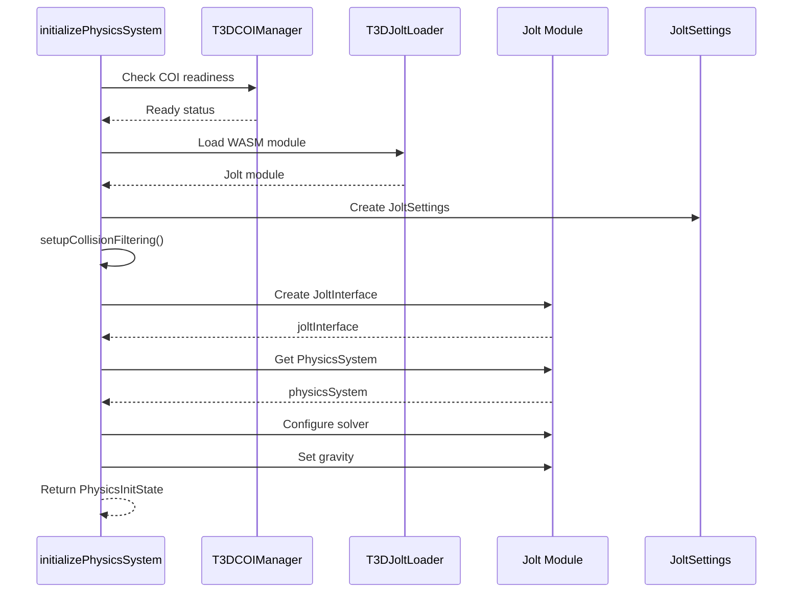

# Initialization Module

## Purpose

The `T3DPhysicsInitializer` module handles the complete initialization process of the Jolt Physics system, including COI (Cross-Origin Isolation) readiness verification, WASM module loading, collision filtering setup, solver configuration, and gravity setup.

## Exports

### Interfaces

#### `PhysicsInitState`

Interface representing the initialized physics system state:

```typescript
interface PhysicsInitState {
  Jolt: JoltModule;
  maxWorkerThreads: number;
  joltInterface: initJolt.JoltInterface;
  physicsSystem: initJolt.PhysicsSystem;
  bodyInterface: initJolt.BodyInterface;
  initialized: boolean;
}
```

**Properties**:

- `Jolt`: The loaded Jolt Physics WASM module
- `maxWorkerThreads`: Number of worker threads configured
- `joltInterface`: Main Jolt interface for physics operations
- `physicsSystem`: The physics system for advanced operations
- `bodyInterface`: Interface for creating and managing physics bodies
- `initialized`: Always `true` when returned from initialization

### Functions

#### `initializePhysicsSystem(maxWorkerThreads: number): Promise<PhysicsInitState>`

Main initialization function that performs the complete physics system setup.

**Parameters**:
- `maxWorkerThreads`: Maximum number of worker threads (1-16, or 0 for single-threaded)

**Returns**: Promise that resolves to `PhysicsInitState` containing all initialized physics system components

**Initialization Steps**:

1. **COI Readiness Verification**: Checks if Cross-Origin Isolation is ready (required for multi-threading)
2. **WASM Module Loading**: Dynamically imports and loads the Jolt Physics WASM module
3. **Settings Creation**: Creates Jolt settings with worker thread configuration
4. **Collision Filtering Setup**: Configures collision layers and broadphase filtering
5. **Interface Creation**: Creates the Jolt interface and physics system
6. **Solver Configuration**: Sets velocity and position solver iterations
7. **Gravity Setup**: Configures gravity vector (default: -9.81 m/s² on Y axis)

**Performance Timing**: Logs timing information for WASM loading and system initialization

**Example**:
```typescript
const initState = await initializePhysicsSystem(5);
// Use initState.Jolt, initState.bodyInterface, etc.
```

#### `setupCollisionFiltering(Jolt: JoltModule, settings: initJolt.JoltSettings): void`

Configures collision filtering for the physics system.

**Parameters**:
- `Jolt`: The Jolt module
- `settings`: Jolt settings object to configure

**Configuration Details**:

1. **Object Layers**:
   - `LAYER_NON_MOVING` (0): For static bodies
   - `LAYER_MOVING` (1): For dynamic bodies

2. **Layer Pair Filter**: Configures which layers can collide:
   - Non-moving ↔ Moving: Enabled
   - Moving ↔ Moving: Enabled
   - Non-moving ↔ Non-moving: Disabled

3. **Broadphase Layers**: Creates separate bounding volume trees:
   - Separate trees for moving and non-moving objects
   - Improves performance by avoiding updates to static object trees

4. **Broadphase Layer Interface**: Maps object layers to broadphase layers (1:1 mapping)

**Usage**: Called internally by `initializePhysicsSystem()`, but can be called separately if custom collision filtering is needed.

## Initialization Flow



## COI (Cross-Origin Isolation) Requirements

Multi-threaded Jolt Physics requires Cross-Origin Isolation (COI) to enable `SharedArrayBuffer`. The initialization process:

1. **Checks COI Readiness**: Verifies COI is ready (unless in VS Code webview)
2. **Warns if Not Ready**: Logs warnings if COI is not ready (may cause worker initialization failures)
3. **Skips Check in Webviews**: VS Code webviews skip the check as they handle COI differently

**Note**: Single-threaded mode (maxWorkerThreads = 0) does not require COI.

## WASM Module Loading

The WASM module is loaded dynamically using:

```typescript
const { loadJolt } = await import('../T3DJoltLoader');
const Jolt: JoltModule = await loadJolt();
```

**Performance Considerations**:

- Production builds typically load in 2-4 seconds
- First load may be slower due to network
- Subsequent loads benefit from browser cache
- Warning is logged if loading takes >10 seconds

## Solver Configuration

The physics solver is configured with safe defaults:

- **Velocity Steps**: 6 iterations (default solver iterations)
- **Position Steps**: 2 iterations (position correction)

These values provide good stability and performance for most use cases. They can be adjusted via `physicsSystem.GetPhysicsSettings()` after initialization if needed.

## Gravity Configuration

Gravity is set to standard Earth gravity:

- **Vector**: `(0, -9.81, 0)`
- **Units**: Meters per second squared (m/s²)
- **Direction**: Downward on Y-axis

Gravity can be modified after initialization using `physicsSystem.SetGravity()`.

## Dependencies

- **T3DPhysicsConfig**: Uses layer constants (`LAYER_NON_MOVING`, `LAYER_MOVING`, `NUM_OBJECT_LAYERS`)
- **T3DCOIManager**: For COI readiness checks
- **T3DJoltLoader**: For loading the WASM module

## Error Handling

The initialization process includes error handling:

- **COI Warnings**: Logged but don't prevent initialization
- **WASM Loading**: Throws if WASM module fails to load
- **Settings Creation**: Errors propagate up to caller

## Usage Example

```typescript
import { initializePhysicsSystem } from './core/T3DPhysicsInitializer';

async function setupPhysics() {
  try {
    const initState = await initializePhysicsSystem(5); // 5 worker threads
    
    // Access initialized components
    const { Jolt, bodyInterface, physicsSystem } = initState;
    
    // Now ready to create physics bodies
    // ...
  } catch (error) {
    console.error('Failed to initialize physics system:', error);
  }
}
```

## Related Documentation

- [Configuration](02-configuration.md) - Layer constants and configuration options
- [Overview](01-overview.md) - Architecture overview
- [COI Documentation](../../coi/docs/README.md) - Cross-Origin Isolation details
