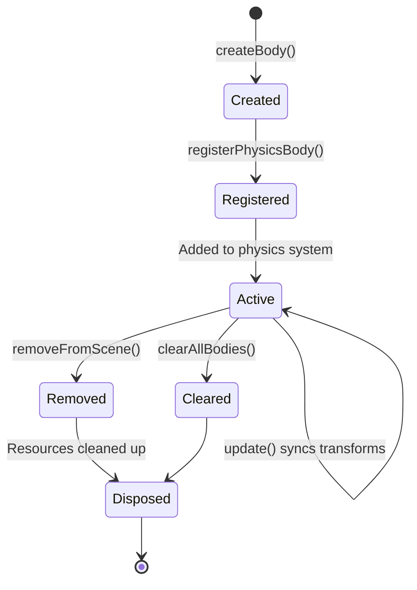

# Body Management Module

## Purpose

The `T3DPhysicsBodyManager` module handles the complete lifecycle of physics bodies, including registration, removal, cleanup, and visual group disposal. It manages the connection between Jolt Physics bodies and their Three.js visual representations.

## Exports

### Interfaces

#### `T3DDynamicObject`

Core interface representing a physics object with its visual representation:

```typescript
interface T3DDynamicObject {
  /** The Three.js object that represents this physics body visually */
  debugMesh: THREE.Object3D;

  /** The Jolt physics body */
  body: initJolt.Body;

  /** The shape type of the physics body (EShapeSubType) */
  shapeType: number;

  /** Optional function to update vertices for soft bodies */
  updateVertex?: () => void;

  /** Optional visual group (e.g., from GLB model) that should be cleaned up when body is removed */
  visualGroup?: THREE.Object3D;

  /** Optional callback function called when the body is removed from the scene */
  onRemoveCallback?: (
    body: initJolt.Body,
    visualGroup?: THREE.Object3D
  ) => void;
}
```

**Properties**:

- `debugMesh`: Three.js object for visualizing the physics body (always present)
- `body`: The Jolt Physics body (always present)
- `shapeType`: EShapeSubType constant identifying the shape type
- `updateVertex`: Optional callback for updating soft body vertices each frame
- `visualGroup`: Optional Three.js group containing the actual visual model (separate from debug mesh)
- `onRemoveCallback`: Optional callback invoked when the body is removed for custom cleanup

#### `BodyManagerState`

Interface for the state passed to body management functions:

```typescript
interface BodyManagerState {
  Jolt: any;
  bodyInterface: initJolt.BodyInterface;
  engine: T3D;
  dynamicObjects: T3DDynamicObject[];
  materialCache: Map<number, THREE.MeshNormalMaterial | THREE.MeshStandardMaterial>;
}
```

### Functions

#### `registerPhysicsBody(state: BodyManagerState, options): T3DDynamicObject`

Registers a physics body with the physics system and creates its visual representation.

**Parameters**:

- `state`: Body manager state containing Jolt module, body interface, engine, etc.
- `options`: Registration options object:
  - `body`: The Jolt Physics body to register (required)
  - `shapeType`: Optional shape type (auto-detected if not provided)
  - `visualGroup`: Optional Three.js object group for visual representation
  - `debugMesh`: Optional pre-created debug mesh (auto-created if not provided)
  - `updateVertex`: Optional vertex update callback for soft bodies
  - `onRemoveCallback`: Optional cleanup callback

**Returns**: `T3DDynamicObject` representing the registered body

**Process**:

1. Adds the body to the physics system via `bodyInterface.AddBody()`
2. Determines shape type (from parameter or by analyzing the body's shape)
3. Creates or uses provided debug mesh
4. Adds debug mesh to the scene
5. Disables shadows on debug mesh
6. Adds to `dynamicObjects` array for tracking
7. Returns the `T3DDynamicObject`

**Example**:
```typescript
const dynamicObj = registerPhysicsBody(state, {
  body: myBody,
  visualGroup: myModelGroup,
  onRemoveCallback: (body, visualGroup) => {
    console.log('Body removed:', body);
  }
});
```

#### `removeFromScene(state: BodyManagerState, dynamicObj: T3DDynamicObject): void`

Removes a physics body from the scene and disposes all its resources.

**Parameters**:

- `state`: Body manager state
- `dynamicObj`: The dynamic object to remove

**Cleanup Process**:

1. Removes body from physics system (`RemoveBody`, `DestroyBody`)
2. Removes debug mesh from scene
3. Disposes debug mesh geometry (materials are cached, not disposed here)
4. Disposes visual group if present (via `disposeVisualGroup`)
5. Invokes `onRemoveCallback` if provided
6. Removes from `dynamicObjects` array

**Example**:
```typescript
removeFromScene(state, dynamicObj);
```

#### `clearAllBodies(state: BodyManagerState, protectedObjects: Set<T3DDynamicObject>): void`

Clears all dynamic objects from the physics system without disposing the entire physics system.

**Parameters**:

- `state`: Body manager state
- `protectedObjects`: Set of objects that should not be automatically removed (cleared after operation)

**Use Cases**:

- Scene resets where physics should remain initialized
- Clearing all bodies before loading a new scene
- Cleanup before disposal

**Process**:

- Iterates through all `dynamicObjects` and removes each one
- Performs the same cleanup as `removeFromScene` for each object
- Clears the `protectedObjects` set after completion

**Example**:
```typescript
clearAllBodies(state, protectedObjectsSet);
```

#### `disposeVisualGroup(engine: T3D, group: THREE.Object3D): void`

Disposes a visual group and all its children, cleaning up geometries and materials.

**Parameters**:

- `engine`: T3D engine instance
- `group`: Three.js object group to dispose

**Cleanup Process**:

1. Traverses the group and all children
2. For each `THREE.Mesh`:
   - Disposes geometry
   - Disposes all materials (including textures: maps, normalMaps, etc.)
3. Removes the group from its parent or the scene

**Texture Cleanup**: Disposes all texture maps:
- `map` (diffuse/albedo)
- `normalMap`
- `roughnessMap`
- `metalnessMap`
- `aoMap` (ambient occlusion)
- `emissiveMap`

**Example**:
```typescript
disposeVisualGroup(engine, myVisualGroup);
```

## Visual Group vs Debug Mesh

The module distinguishes between two types of visual representations:

### Debug Mesh

- **Purpose**: Wireframe visualization of the physics shape
- **Always Created**: Automatically created for every body
- **Material**: Cached materials shared across bodies
- **Disposal**: Geometry disposed, materials cached

### Visual Group

- **Purpose**: Actual visual model (e.g., from GLB file)
- **Optional**: Only present when provided during registration
- **Material**: Unique materials specific to the model
- **Disposal**: Complete disposal of all geometries and materials

Both are tracked in `T3DDynamicObject` and both are synchronized with the physics body's transform during the update loop.

## Body Lifecycle



## Material Cache Management

The material cache is shared across all bodies and managed at the `T3DPhysics` class level:

- **Shared Materials**: Debug mesh materials are cached by shape type
- **Not Disposed on Removal**: Materials remain in cache when bodies are removed
- **Disposed on System Disposal**: All cached materials are disposed when the physics system is disposed

This approach:
- Reduces memory usage (one material per shape type, not per body)
- Improves performance (materials are reused)
- Simplifies cleanup (materials disposed once at system disposal)

## Usage Patterns

### Basic Registration

```typescript
// Simple body registration
const body = bodyInterface.CreateBody(settings);
const dynamicObj = registerPhysicsBody(state, { body });
```

### Registration with Visual Model

```typescript
// Register body with visual model from GLB
const body = bodyInterface.CreateBody(settings);
const model = await loadGLB('model.glb');
const dynamicObj = registerPhysicsBody(state, {
  body,
  visualGroup: model.scene,
});
```

### Registration with Custom Cleanup

```typescript
// Register with cleanup callback
const dynamicObj = registerPhysicsBody(state, {
  body,
  onRemoveCallback: (body, visualGroup) => {
    // Custom cleanup logic
    console.log('Cleaning up body:', body.GetID());
    // Dispose custom resources, etc.
  }
});
```

### Soft Body Registration

```typescript
// Register soft body with vertex update
const softBody = createSoftBody();
const { debugMesh, updateVertex } = getSoftBodyMesh(Jolt, softBody, getMaterial);
const dynamicObj = registerPhysicsBody(state, {
  body: softBody,
  debugMesh,
  updateVertex,
});
```

## Dependencies

- **T3DPhysicsDebugMesh**: For creating debug meshes and shape type detection
- **T3D Engine**: For scene access and visual group disposal
- **Jolt Module**: For body interface operations

## Related Documentation

- [Debug Meshes](05-debug-meshes.md) - Debug mesh creation details
- [Update Loop](08-update-loop.md) - How bodies are updated each frame
- [Body Factories](07-body-factories.md) - Factory methods that use body management
