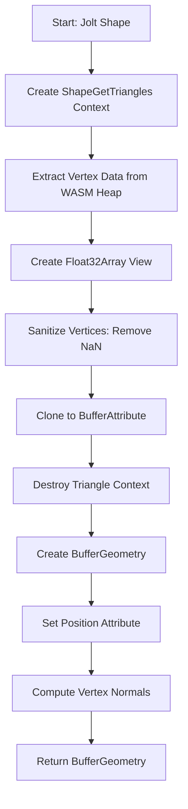

# Shape Meshes Module

## Purpose

The `T3DPhysicsShapeMesh` module provides utilities for converting Jolt Physics shapes into Three.js BufferGeometry. It handles triangle extraction from Jolt shapes, soft body mesh creation, and geometry validation.

## Exports

### Functions

#### `createMeshForShape(Jolt, shape): THREE.BufferGeometry`

Creates a THREE.js BufferGeometry from a Jolt Shape by extracting triangle data.

**Parameters**:

- `Jolt`: Jolt module instance
- `shape`: Jolt Physics Shape to convert

**Returns**: THREE.BufferGeometry ready for use in Three.js meshes

**Process**:

1. **Triangle Extraction**: Uses `ShapeGetTriangles` to extract triangle data from the Jolt shape
2. **Vertex Data Access**: Creates a Float32Array view on the triangle vertex data from WASM heap
3. **NaN Sanitization**: Validates and sanitizes vertices to prevent NaN values
4. **Buffer Creation**: Creates a Three.js BufferAttribute from sanitized vertices
5. **Geometry Creation**: Creates BufferGeometry and sets position attribute
6. **Normal Computation**: Computes vertex normals for proper lighting
7. **Cleanup**: Destroys Jolt triangle context to free WASM heap memory

**Triangle Extraction Details**:

- Uses `ShapeGetTriangles` with:
  - Shape to extract from
  - Bounding box: `AABox.sBiggest()` (includes entire shape)
  - Center of mass: Shape's center of mass
  - Identity rotation and unit scale
- Gets a view (not copy) on the vertex data from WASM heap memory
- Clones the buffer attribute to ensure data persists after WASM cleanup

**NaN Validation**:

- Checks each vertex value with `isFinite()`
- Replaces NaN/Infinity values with 0
- Logs warning if NaN values are detected
- Prevents rendering errors and crashes

**Normal Computation**:

- Computes vertex normals using `geometry.computeVertexNormals()`
- Wrapped in try-catch to handle edge cases
- Only computes if valid vertices exist
- May fail for degenerate geometries (handled gracefully)

**Memory Management**:

- WASM heap memory is limited, so triangle context is destroyed after use
- BufferAttribute is cloned to ensure data persists after WASM cleanup
- Prevents memory leaks from WASM heap

**Example**:
```typescript
import { createMeshForShape } from './core/T3DPhysicsShapeMesh';

const shape = new Jolt.BoxShape(halfExtent, 0.05);
const geometry = createMeshForShape(Jolt, shape);
const mesh = new THREE.Mesh(geometry, material);
```

#### `getSoftBodyMesh(Jolt, body, getDebugMeshMaterial)`

Creates a soft body mesh from a Jolt Body with dynamic vertex updates.

**Parameters**:

- `Jolt`: Jolt module instance
- `body`: Jolt Physics soft body
- `getDebugMeshMaterial`: Function to get material for a shape type

**Returns**: Object with:
- `debugMesh`: THREE.Mesh representing the soft body
- `updateVertex`: Function to update vertex positions each frame

**Soft Body Details**:

Soft bodies have dynamic vertex positions that change during simulation. This function:

1. **Vertex Access**: Accesses soft body vertex data from motion properties
2. **Face Data**: Extracts face indices for triangle definition
3. **Geometry Creation**: Creates BufferGeometry with dynamic vertex positions
4. **Material**: Gets material using the provided callback (defaults to ConvexHull shape type)
5. **Update Function**: Creates update callback that:
   - Updates vertex positions from Jolt vertex data
   - Computes new normals
   - Marks attributes as needing update

**Vertex Data Access**:

- Accesses `SoftBodyMotionProperties` from the body
- Gets vertex settings and position offset
- Creates Float32Array views on vertex positions in WASM heap
- Updates positions directly from WASM memory each frame

**Face Data**:

- Extracts face indices from soft body settings
- Creates index buffer for the geometry
- Uses Uint32Array for face indices

**Update Function**:

The returned `updateVertex` function:
- Copies vertex positions from Jolt vertex data to geometry
- Recomputes vertex normals for proper lighting
- Marks position and normal attributes as needing update
- Should be called each frame in the update loop

**Material**:

- Uses double-sided material for soft bodies
- Gets material via callback (typically from material cache)
- Defaults to ConvexHull shape type material

**Example**:
```typescript
import { getSoftBodyMesh } from './core/T3DPhysicsShapeMesh';

const getMaterial = (shapeType) => getDebugMeshMaterial(Jolt, shapeType, cache);
const { debugMesh, updateVertex } = getSoftBodyMesh(Jolt, softBody, getMaterial);

// In update loop:
updateVertex(); // Update vertex positions
```

## Triangle Extraction Process

The triangle extraction process works as follows:



## Memory Management

### WASM Heap Considerations

Jolt Physics uses WASM (WebAssembly) which has limited heap memory. The module carefully manages memory:

1. **Triangle Context**: Created temporarily, destroyed after use
2. **Buffer Cloning**: Data is cloned from WASM heap to JavaScript memory
3. **Direct Memory Access**: Uses TypedArray views for efficient access
4. **Cleanup**: All Jolt objects are destroyed when no longer needed

### Memory Efficiency

- Vertex data is extracted only when needed
- Triangle context is destroyed immediately after extraction
- Geometry data persists in JavaScript memory (BufferAttribute)
- No unnecessary copies or memory leaks

## Geometry Validation

The module includes comprehensive validation to prevent errors:

### NaN Detection

- All vertex values are checked with `isFinite()`
- Invalid values are replaced with 0
- Warnings are logged for debugging

### Normal Computation Safety

- Normal computation is wrapped in try-catch
- Handles degenerate geometries gracefully
- Only computes if valid geometry exists

### Error Handling

- Invalid geometries don't crash the system
- Warnings provide debugging information
- Fallback values ensure rendering continues

## Performance Considerations

1. **Triangle Extraction**: Efficient direct memory access via TypedArray views
2. **Memory Cleanup**: Immediate cleanup of WASM resources
3. **Geometry Reuse**: Geometry can be reused across frames (for static shapes)
4. **Soft Body Updates**: Efficient vertex updates via direct memory access

## Use Cases

### Static Shape Conversion

For static shapes that don't change:

```typescript
const geometry = createMeshForShape(Jolt, staticShape);
// Geometry can be reused indefinitely
```

### Dynamic Shape Updates

For shapes that change (rare):

```typescript
// Recreate geometry when shape changes
const newGeometry = createMeshForShape(Jolt, modifiedShape);
mesh.geometry = newGeometry;
mesh.geometry.dispose(); // Dispose old geometry
```

### Soft Body Rendering

For soft bodies with dynamic vertices:

```typescript
const { debugMesh, updateVertex } = getSoftBodyMesh(Jolt, softBody, getMaterial);

// In update loop:
updateVertex(); // Update each frame
```

## Dependencies

This module has **no dependencies** on other core modules. It only depends on:

- Jolt module for shape access
- Three.js for geometry types

## Limitations

1. **Triangle-Only**: Only extracts triangle data (no support for other primitives)
2. **Static Geometry**: `createMeshForShape` creates static geometry (vertices don't update)
3. **WASM Memory**: Limited by WASM heap size for large shapes
4. **Performance**: Triangle extraction can be slow for complex meshes

## Related Documentation

- [Debug Meshes](05-debug-meshes.md) - How shape meshes are used in debug visualization
- [Update Loop](08-update-loop.md) - How soft body updates work in the update loop
- [Body Management](04-body-management.md) - Integration with body management
