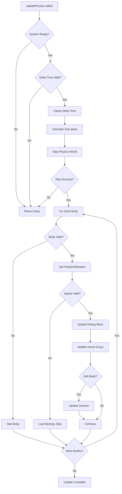

# Update Loop Module

## Purpose

The `T3DPhysicsUpdate` module handles the physics simulation update cycle, including time stepping, sub-stepping, body transform synchronization, and pause/resume functionality.

## Exports

### Interfaces

#### `UpdateState`

Interface representing the state for physics update operations:

```typescript
interface UpdateState {
  Jolt: JoltModule;
  joltInterface: initJolt.JoltInterface;
  dynamicObjects: T3DDynamicObject[];
  frameCount: number;
  accumulatedTime: number;
  disposed: boolean;
  initialized: boolean;
  paused: boolean;
}
```

**Properties**:

- `Jolt`: Jolt module instance
- `joltInterface`: Jolt interface for stepping physics
- `dynamicObjects`: Array of dynamic objects to update
- `frameCount`: Current frame count (incremented each update)
- `accumulatedTime`: Accumulated time (incremented by deltaTime each update)
- `disposed`: Whether the physics system is disposed
- `initialized`: Whether the physics system is initialized
- `paused`: Whether physics updates are paused

### Functions

#### `updatePhysics(state: UpdateState, deltaTimeSeconds: number): void`

Main update function that steps the physics simulation and synchronizes transforms.

**Parameters**:

- `state`: Update state containing physics system state
- `deltaTimeSeconds`: Time delta in seconds since last update

**Update Process**:

1. **Validation**: Checks if system is initialized, not disposed, and not paused
2. **Time Validation**: Validates delta time (must be > 0 and <= 1.0)
3. **Time Clamping**: Clamps maximum delta time to prevent "spiral of death" (max 1/30s)
4. **Sub-stepping**: Calculates number of sub-steps needed (30 Hz base rate, max 4 steps)
5. **Physics Step**: Steps physics world with calculated step size and sub-steps
6. **Transform Sync**: Synchronizes body positions/rotations to debug meshes and visual groups
7. **Soft Body Updates**: Updates soft body vertices if needed

**Time Stepping**:

- Base physics rate: 30 Hz (step size: 1/30s ≈ 0.033s)
- Sub-stepping: Automatically calculates number of sub-steps for smooth physics
- Maximum sub-steps: 4 (prevents excessive computation)
- Time clamping: Maximum delta time clamped to 1/30s to prevent instability

**Transform Synchronization**:

For each dynamic object:
1. Validates body is still valid (checks body ID)
2. Gets body position and rotation
3. Validates values (checks for NaN)
4. Updates debug mesh position and rotation
5. Updates visual group position and rotation (if present)
6. Updates matrix world for visual group
7. Updates soft body vertices (if soft body)

**Error Handling**:

- Try-catch around physics step (handles hot reload scenarios)
- Body validation before access (handles destroyed bodies)
- NaN validation for positions/rotations (prevents rendering errors)
- Graceful degradation on errors

#### `startPhysics(state: UpdateState): void`

Resumes physics updates if they were paused.

**Parameters**:
- `state`: Update state

**Behavior**:
- Checks if system is disposed or not initialized
- Sets `paused` to `false`
- Logs warnings if system is not ready

**Example**:
```typescript
startPhysics(updateState);
```

#### `stopPhysics(state: UpdateState): void`

Pauses physics updates (bodies remain in their current state).

**Parameters**:
- `state`: Update state

**Behavior**:
- Sets `paused` to `true`
- Physics simulation stops updating
- Bodies remain in their current positions/rotations

**Example**:
```typescript
stopPhysics(updateState);
```

#### `isPaused(state: UpdateState): boolean`

Checks if physics simulation is paused.

**Parameters**:
- `state`: Update state

**Returns**: `true` if paused, `false` if running

**Example**:
```typescript
if (isPaused(updateState)) {
  console.log('Physics is paused');
}
```

## Update Cycle Flow



## Time Stepping Details

### Sub-stepping Algorithm

The update loop uses sub-stepping to maintain stable physics:

1. **Base Rate**: 30 Hz (step size = 1/30s ≈ 0.033s)
2. **Sub-step Calculation**: `ceil(deltaTime / stepSize)`
3. **Maximum Sub-steps**: 4 (prevents excessive computation)
4. **Actual Step Size**: `deltaTime / numSteps` (ensures smooth physics)

**Example**:

- Delta time: 0.05s (50ms, ~20 FPS)
- Base step size: 0.033s
- Sub-steps needed: `ceil(0.05 / 0.033) = 2`
- Actual step size: `0.05 / 2 = 0.025s`
- Physics stepped 2 times with 0.025s each

### Time Clamping

Delta time is clamped to prevent "spiral of death":

- Maximum delta time: 1/30s (0.033s)
- Prevents physics from trying to simulate too much time at once
- Maintains stability when frame rate drops

### Validation

Delta time is validated:

- Must be > 0 (skip if zero or negative)
- Must be <= 1.0 (skip if too large, indicates problem)

## Transform Synchronization

The update loop synchronizes physics body transforms to visual representations:

### Debug Mesh Sync

- Position: Copied from body position
- Rotation: Copied from body rotation (quaternion)
- Updated every frame

### Visual Group Sync

- Position: Synchronized with body position
- Rotation: Synchronized with body rotation
- Matrix World: Updated for proper rendering
- Only updated if visual group exists

### Validation

All transforms are validated:

- NaN check for positions (x, y, z)
- NaN check for rotations (x, y, z, w)
- Invalid values are skipped (warnings logged)
- Prevents rendering errors and crashes

## Soft Body Updates

For soft bodies with dynamic vertices:

1. Checks if body is a soft body (`EBodyType_SoftBody`)
2. If `updateVertex` callback exists, calls it
3. Otherwise, recreates geometry from shape (fallback)

The `updateVertex` callback:
- Updates vertex positions from Jolt vertex data
- Recomputes normals
- Marks attributes as needing update

## Pause/Resume Functionality

Physics updates can be paused and resumed:

### Pausing

- Sets `paused` flag to `true`
- Physics stops stepping
- Bodies remain in current state
- Transform synchronization stops

### Resuming

- Sets `paused` flag to `false`
- Physics resumes stepping
- Bodies continue from where they were paused

### Use Cases

- Pausing simulation for debugging
- Pausing during scene transitions
- Pausing when window is not visible
- User-controlled pause/resume

## Performance Considerations

1. **Sub-stepping**: Maintains stability without excessive computation
2. **Early Returns**: Skips update if system not ready
3. **Validation**: Prevents unnecessary work on invalid data
4. **Efficient Access**: Direct property access where possible
5. **Error Handling**: Graceful degradation on errors

## Error Handling

The update loop includes comprehensive error handling:

### Physics Step Errors

- Wrapped in try-catch
- Sets disposed flag on error
- Silently handles hot reload scenarios
- Prevents console spam

### Body Access Errors

- Validates body before access
- Skips invalid/destroyed bodies
- Continues with remaining bodies
- Prevents crashes from invalid bodies

### Transform Errors

- Validates positions/rotations
- Skips invalid values
- Logs warnings for debugging
- Prevents NaN propagation

## Usage Example

```typescript
import { updatePhysics, startPhysics, stopPhysics } from './core/T3DPhysicsUpdate';

// In game loop
function gameLoop(deltaTime) {
  const updateState: UpdateState = {
    Jolt: physics.Jolt,
    joltInterface: physics.joltInterface,
    dynamicObjects: physics.dynamicObjects,
    frameCount: physics.frameCount,
    accumulatedTime: physics.accumulatedTime,
    disposed: physics.disposed,
    initialized: physics.initialized,
    paused: physics.paused,
  };
  
  updatePhysics(updateState, deltaTime);
  
  // Sync state back
  physics.frameCount = updateState.frameCount;
  physics.accumulatedTime = updateState.accumulatedTime;
}

// Pause/resume
function pausePhysics() {
  const updateState = getUpdateState();
  stopPhysics(updateState);
  physics.paused = updateState.paused;
}
```

## Dependencies

- **T3DPhysicsBodyManager**: For `T3DDynamicObject` type
- **T3DPhysicsUtils**: For type conversion utilities
- **T3DPhysicsShapeMesh**: For soft body geometry recreation

## Related Documentation

- [Body Management](04-body-management.md) - Dynamic object structure
- [Utilities](09-utilities.md) - Type conversion utilities
- [Shape Meshes](06-shape-meshes.md) - Soft body geometry
