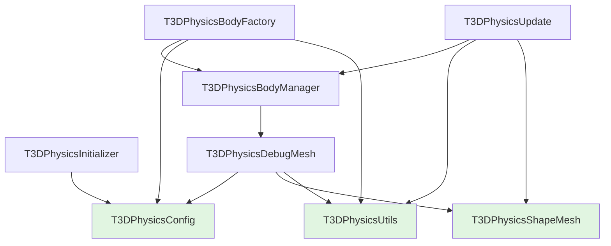

# Module Dependencies

## Purpose

This document describes the dependency relationships between core modules, state management patterns, and best practices for using the modules.

## Dependency Graph



**Legend**:
- Green nodes: No dependencies (foundation modules)
- Blue nodes: Depend on foundation modules
- Arrows: Dependency direction (A → B means A depends on B)

## Module Dependency Details

### Foundation Modules (No Dependencies)

These modules have no dependencies on other core modules:

#### `T3DPhysicsConfig`
- **Dependencies**: None (only external: T3DEngineConfig, PhysicsOptions)
- **Used By**: Initializer, DebugMesh, BodyFactory
- **Purpose**: Constants and configuration

#### `T3DPhysicsUtils`
- **Dependencies**: None (only external: Jolt, Three.js)
- **Used By**: DebugMesh, Update, BodyFactory
- **Purpose**: Pure utility functions

#### `T3DPhysicsShapeMesh`
- **Dependencies**: None (only external: Jolt, Three.js)
- **Used By**: DebugMesh, Update
- **Purpose**: Shape-to-geometry conversion

### Dependent Modules

#### `T3DPhysicsInitializer`
- **Dependencies**: `T3DPhysicsConfig`
- **External**: T3DCOIManager, T3DJoltLoader
- **Purpose**: System initialization

#### `T3DPhysicsDebugMesh`
- **Dependencies**: `T3DPhysicsConfig`, `T3DPhysicsShapeMesh`, `T3DPhysicsUtils`
- **Purpose**: Debug mesh creation

#### `T3DPhysicsBodyManager`
- **Dependencies**: `T3DPhysicsDebugMesh`
- **External**: T3D Engine
- **Purpose**: Body lifecycle management

#### `T3DPhysicsUpdate`
- **Dependencies**: `T3DPhysicsBodyManager`, `T3DPhysicsUtils`, `T3DPhysicsShapeMesh`
- **Purpose**: Physics update loop

#### `T3DPhysicsBodyFactory`
- **Dependencies**: `T3DPhysicsBodyManager`, `T3DPhysicsConfig`, `T3DPhysicsUtils`
- **Purpose**: Body factory methods

## State Management Patterns

The modules use a **state object pattern** where state is passed to functions rather than maintained within modules.

### State Interfaces

Each module that needs state defines an interface:

```typescript
// Initialization state
interface PhysicsInitState {
  Jolt: JoltModule;
  joltInterface: initJolt.JoltInterface;
  // ...
}

// Body management state
interface BodyManagerState {
  Jolt: any;
  bodyInterface: initJolt.BodyInterface;
  engine: T3D;
  dynamicObjects: T3DDynamicObject[];
  materialCache: Map<number, Material>;
}

// Update state
interface UpdateState {
  Jolt: JoltModule;
  joltInterface: initJolt.JoltInterface;
  dynamicObjects: T3DDynamicObject[];
  // ...
}

// Factory state (extends BodyManagerState)
interface BodyFactoryState extends BodyManagerState {
  physicsSystem: initJolt.PhysicsSystem;
}
```

### State Ownership

The main `T3DPhysics` class owns all state:

```typescript
class T3DPhysics {
  private Jolt!: JoltModule;
  private physicsSystem!: initJolt.PhysicsSystem;
  private bodyInterface!: initJolt.BodyInterface;
  private dynamicObjects: T3DDynamicObject[] = [];
  private materialCache: Map<...> = new Map();
  // ...
}
```

### State Passing

State is passed to module functions:

```typescript
// Example: Update loop
const updateState: UpdateState = {
  Jolt: this.Jolt,
  joltInterface: this.joltInterface,
  dynamicObjects: this.dynamicObjects,
  frameCount: this.frameCount,
  accumulatedTime: this.accumulatedTime,
  disposed: this.disposed,
  initialized: this.initialized,
  paused: this.paused,
};
updatePhysics(updateState, deltaTimeSeconds);
```

### State Mutability

State objects contain references to mutable data:

- **Arrays**: `dynamicObjects` array is mutable, changes persist
- **Objects**: Jolt objects are mutable, changes persist
- **Primitives**: Numbers are copied, must sync back if modified

**Important**: For primitive values (frameCount, accumulatedTime, etc.), changes must be synced back:

```typescript
updatePhysics(updateState, deltaTime);
// Sync back primitive values
this.frameCount = updateState.frameCount;
this.accumulatedTime = updateState.accumulatedTime;
```

## Module Communication Patterns

### 1. Function Calls

Modules call functions from other modules directly:

```typescript
// BodyManager calls DebugMesh functions
import { createDebugMesh } from './T3DPhysicsDebugMesh';
const result = createDebugMesh(Jolt, body, shapeType, materialCache);
```

### 2. State Objects

State is passed as parameters:

```typescript
// T3DPhysics passes state to modules
const state: BodyManagerState = { /* ... */ };
registerPhysicsBody(state, options);
```

### 3. Callbacks

Some modules accept callback functions:

```typescript
// ShapeMesh accepts material getter callback
getSoftBodyMesh(Jolt, body, getDebugMeshMaterial);
```

## Dependency Rules

### Allowed Patterns

1. **Foundation → Dependent**: Foundation modules can be used by dependent modules
2. **Direct Imports**: Modules can import from modules they depend on
3. **State Passing**: State can be passed to any module that accepts it
4. **Callbacks**: Modules can accept callbacks for flexibility

### Disallowed Patterns

1. **Circular Dependencies**: Modules cannot depend on each other circularly
2. **Reverse Dependencies**: Dependent modules cannot be imported by foundation modules
3. **Global State**: Modules should not maintain global state
4. **Side Effects**: Modules should avoid side effects (except through state)

## Module Interaction Examples

### Body Registration Flow

```typescript
// T3DPhysics.registerPhysicsBody()
const state: BodyManagerState = { /* state */ };
registerPhysicsBody(state, { body });

// BodyManager.registerPhysicsBody()
const shapeType = getShapeType(Jolt, body); // Calls DebugMesh
const result = createDebugMesh(Jolt, body, shapeType, cache); // Calls DebugMesh
// DebugMesh uses ShapeMesh and Utils internally
```

### Update Loop Flow

```typescript
// T3DPhysics.update()
const updateState: UpdateState = { /* state */ };
updatePhysics(updateState, deltaTime);

// Update.updatePhysics()
for (const obj of dynamicObjects) {
  const pos = wrapVec3(body.GetPosition()); // Uses Utils
  // ...
  if (softBody) {
    createMeshForShape(shape); // Uses ShapeMesh
  }
}
```

### Factory Method Flow

```typescript
// T3DPhysics.createBox()
const factoryState: BodyFactoryState = { /* state */ };
createBox(factoryState, position, rotation, extent, motionType, layer);

// Factory.createBox()
const body = bodyInterface.CreateBody(settings);
registerPhysicsBody(state, { body }); // Calls BodyManager
// BodyManager uses DebugMesh, which uses ShapeMesh and Utils
```

## Best Practices

### 1. State Management

- ✅ **Do**: Pass state objects to module functions
- ✅ **Do**: Sync primitive values back after function calls
- ❌ **Don't**: Maintain state in modules
- ❌ **Don't**: Use global state

### 2. Module Usage

- ✅ **Do**: Import modules you depend on directly
- ✅ **Do**: Use state objects for passing data
- ❌ **Don't**: Create circular dependencies
- ❌ **Don't**: Access other modules' internals

### 3. Function Design

- ✅ **Do**: Make functions pure when possible
- ✅ **Do**: Accept state objects as parameters
- ✅ **Do**: Return new objects, don't mutate inputs unnecessarily
- ❌ **Don't**: Create side effects outside of state mutations

### 4. Dependencies

- ✅ **Do**: Keep dependencies minimal
- ✅ **Do**: Use foundation modules when possible
- ❌ **Don't**: Create unnecessary dependencies
- ❌ **Don't**: Break dependency hierarchy

## Dependency Analysis

### Most Independent Modules

These modules have no dependencies on other core modules:
1. `T3DPhysicsConfig` (0 dependencies)
2. `T3DPhysicsUtils` (0 dependencies)
3. `T3DPhysicsShapeMesh` (0 dependencies)

### Most Dependent Modules

These modules depend on multiple other modules:
1. `T3DPhysicsUpdate` (3 dependencies: BodyManager, Utils, ShapeMesh)
2. `T3DPhysicsBodyFactory` (3 dependencies: BodyManager, Config, Utils)
3. `T3DPhysicsDebugMesh` (3 dependencies: Config, ShapeMesh, Utils)

### Critical Path Modules

Modules that many other modules depend on:
1. `T3DPhysicsBodyManager` (used by Update, Factory)
2. `T3DPhysicsDebugMesh` (used by BodyManager)
3. `T3DPhysicsConfig` (used by Initializer, DebugMesh, Factory)

## Testing Implications

The dependency structure enables testing strategies:

1. **Foundation Modules**: Easy to test (pure functions, no dependencies)
2. **Dependent Modules**: Can be tested with mocked dependencies
3. **State Objects**: Can be mocked for testing
4. **Isolation**: Modules can be tested in isolation

## Future Considerations

The modular structure enables:

1. **Lazy Loading**: Modules could be loaded on-demand
2. **Code Splitting**: Modules could be split into separate bundles
3. **Alternative Implementations**: Modules could be swapped with alternatives
4. **Feature Flags**: Features could be conditionally included/excluded

## Related Documentation

- [Overview](01-overview.md) - Architecture overview
- [Configuration](02-configuration.md) - Configuration module
- [Body Management](04-body-management.md) - Body manager module
- [Update Loop](08-update-loop.md) - Update module
