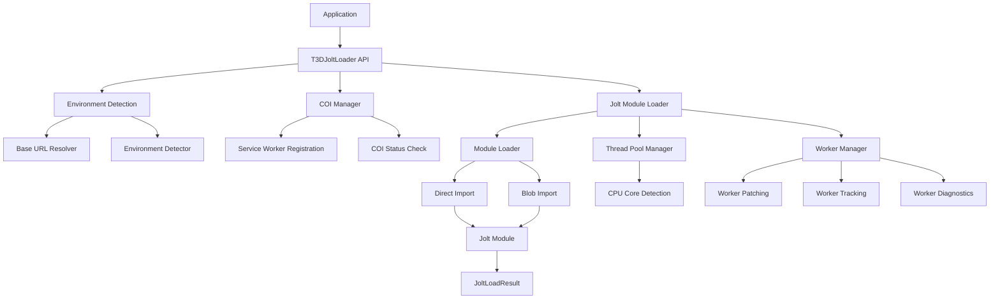
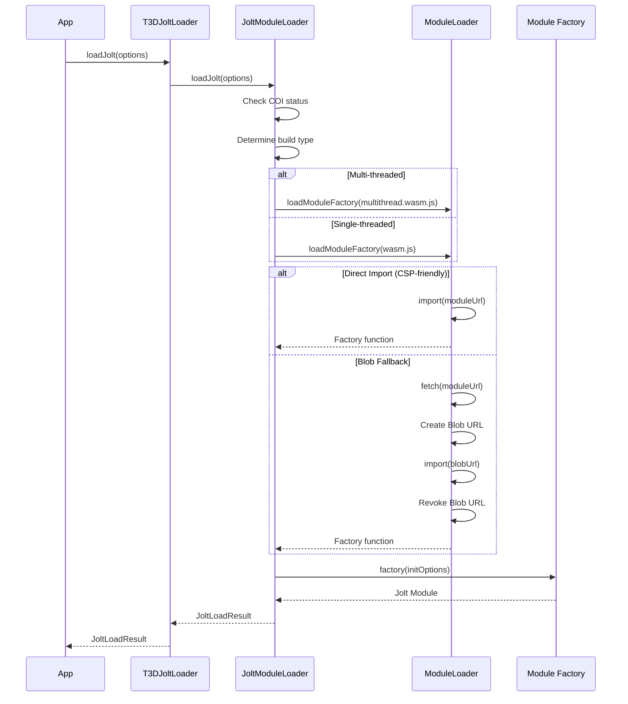
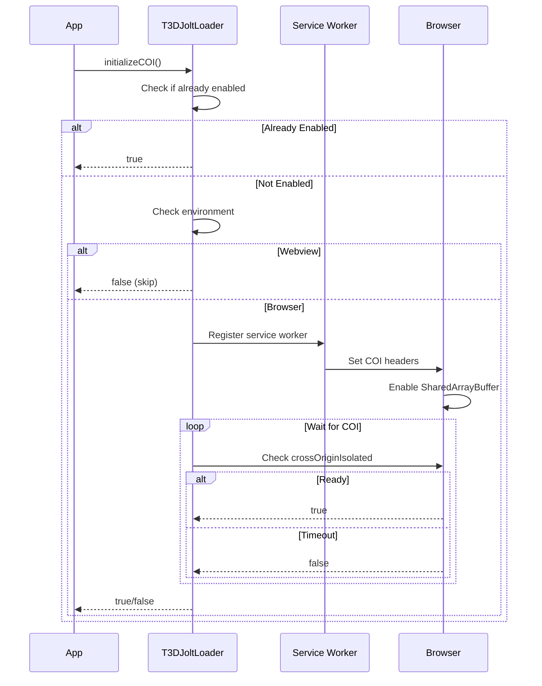
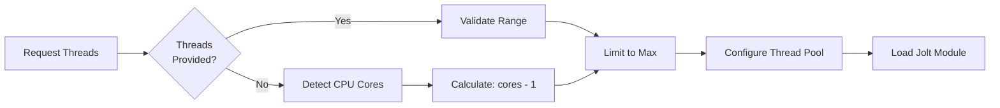
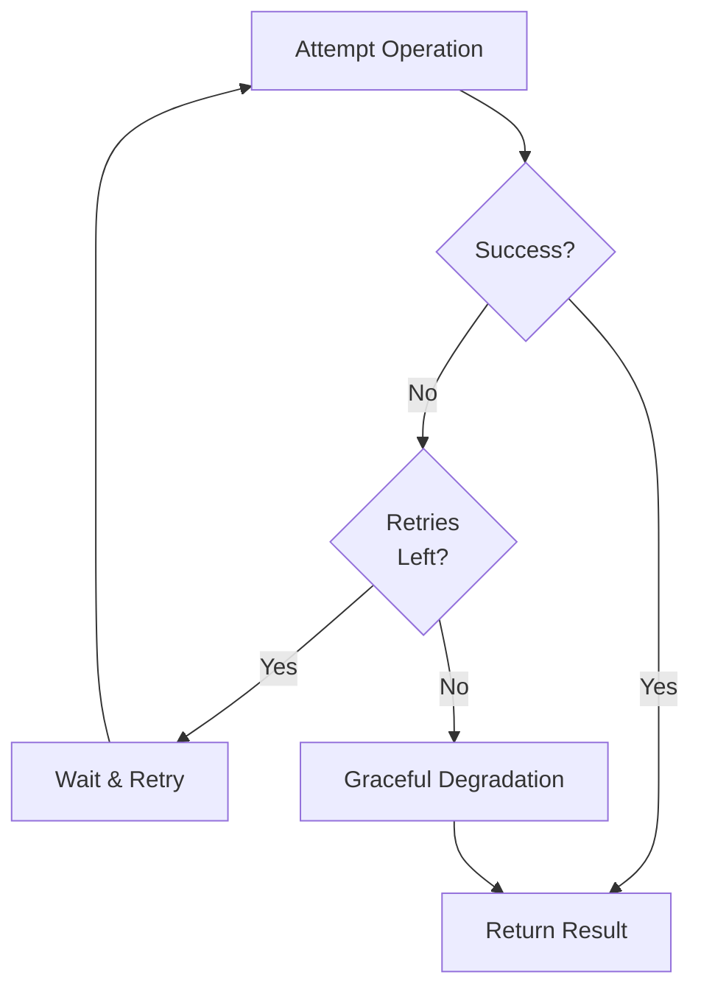
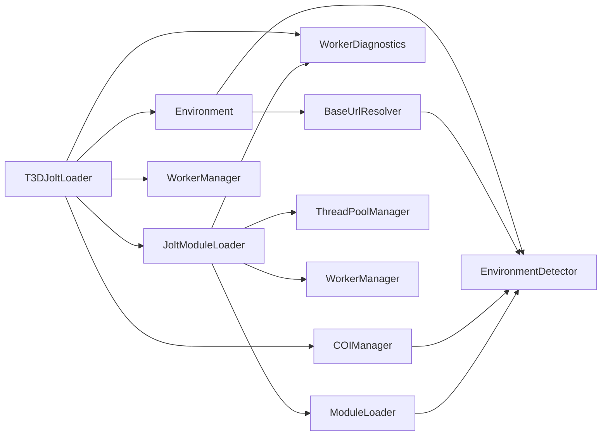

# T3DJoltLoader Documentation

## Overview

`T3DJoltLoader` is an enhanced Jolt Physics loader that provides comprehensive WASM module loading with improved error handling, configuration, and monitoring capabilities. It supports both single-threaded and multi-threaded Jolt Physics builds, with automatic environment detection and graceful degradation.

## Key Features

- **Enhanced Error Handling**: Graceful degradation with retry logic for failed operations
- **Thread Pool Configuration**: Auto-detection of optimal worker thread count based on CPU cores
- **Reduced Verbose Logging**: Summary logging instead of per-worker messages
- **Performance Monitoring**: Tracks load times and worker creation
- **Worker Health Checks**: Monitors worker status and thread pool configuration
- **Retry Logic**: Automatic retries for failed module loads and COI initialization
- **Comprehensive TypeScript Types**: Full type safety for all operations
- **Environment Detection**: Automatically detects browser vs. webview environments
- **COI Support**: Cross-Origin Isolation initialization for multi-threaded physics
- **CSP Compatibility**: Handles Content Security Policy constraints in webviews

## Architecture

The loader follows a modular architecture with clear separation of concerns:

### Module Structure

```
jolt-loader/
├── T3DJoltLoader.ts              # Main orchestrator (public API)
├── core/
│   ├── JoltModuleLoader.ts       # Core Jolt loading logic
│   ├── ModuleLoader.ts           # ES module loading with retry
│   └── ThreadPoolManager.ts      # Thread pool configuration
├── workers/
│   ├── WorkerManager.ts          # Worker patching and management
│   └── WorkerDiagnostics.ts      # Worker status checking
├── coi/
│   └── COIManager.ts             # Cross-Origin Isolation initialization
├── environment/
│   ├── EnvironmentDetector.ts     # Environment detection utilities
│   └── BaseUrlResolver.ts        # Base URL resolution logic
├── types.ts                      # Type definitions
└── T3DJoltLoaderConfig.ts        # Configuration
```

### High-Level Architecture



### Module Responsibilities

- **T3DJoltLoader**: Public API facade that delegates to specialized modules
- **Environment**: Detects webview vs browser, resolves base URLs automatically
- **Workers**: Manages worker constructor patching, tracking, and diagnostics
- **COI**: Handles Cross-Origin Isolation initialization via service workers
- **Core**: ES module loading, thread pool configuration, and Jolt loading logic

## Main Methods

### `initializeJolt(options?)`

The primary method for initializing Jolt Physics. This is the recommended entry point as it handles the complete initialization flow including COI setup.

**Parameters:**
- `options.baseUrl?`: Base URL for Jolt WASM files (auto-detected if not provided)
- `options.maxWorkerThreads?`: Maximum worker threads (1-16, auto-detected if not provided)
- `options.quiet?`: Suppress logging (default: `false`)

**Returns:** `Promise<JoltLoadResult>`

**Flow:**
1. Resolves baseUrl automatically (handles webview vs. browser environments)
2. Checks worker status
3. Initializes COI (Cross-Origin Isolation) if needed
4. Loads Jolt Physics module (multi-threaded or single-threaded)
5. Returns result with Jolt module and status information

**Example:**
```typescript
const result = await T3DJoltLoader.initializeJolt({
  maxWorkerThreads: 4,
  quiet: false
});

if (result.error) {
  console.error('Failed to load Jolt:', result.error);
} else {
  console.log(`Jolt loaded: ${result.threaded ? 'multi-threaded' : 'single-threaded'}`);
  console.log(`Worker count: ${result.workerCount || 0}`);
}
```

### `initializeCOI(options?)`

Initializes Cross-Origin Isolation (COI) which is required for `SharedArrayBuffer` support, enabling multi-threaded Jolt Physics.

**Parameters:**
- `options.serviceWorkerPath?`: Path to COI service worker (default: `/t3d-coi-serviceworker.js`)
- `options.quiet?`: Suppress logging (default: `false`)
- `options.maxWaitTime?`: Maximum wait time for COI to be ready (default: 10000ms)
- `options.retryAttempts?`: Number of retry attempts (default: 3)

**Returns:** `Promise<boolean>` - `true` if COI is enabled, `false` otherwise

**Flow:**
1. Checks if COI is already enabled
2. Detects environment (webviews skip COI as service workers aren't supported)
3. Checks secure context (HTTPS or localhost required)
4. Registers COI service worker with retry logic
5. Waits for COI to be ready (checks `crossOriginIsolated` flag)
6. Handles page reloads if service worker needs activation

**Note:** This method is automatically called by `initializeJolt()`, so you typically don't need to call it directly.

### `loadJolt(options)`

Loads the Jolt Physics WASM module with enhanced error handling. This method is called internally by `initializeJolt()`.

**Parameters:**
- `options.baseUrl`: Base URL for Jolt WASM files
- `options.preferThreads?`: Prefer multi-threaded build (default: `true`)
- `options.maxWorkerThreads?`: Maximum worker threads (1-16)
- `options.quiet?`: Suppress logging (default: `false`)
- `options.retryAttempts?`: Number of retry attempts (default: 3)
- `options.retryDelay?`: Delay between retries in ms (default: 1000)

**Returns:** `Promise<JoltLoadResult>`

**Flow:**
1. Determines if multi-threading is available (checks COI status)
2. Loads appropriate build (multi-threaded or single-threaded)
3. Configures thread pool for multi-threaded builds
4. Initializes Emscripten module
5. Tracks worker creation and thread pool size
6. Returns result with module and status

### `getJolt()`

Retrieves the Jolt module from the last successful load.

**Returns:** `JoltModule | undefined`

**Example:**
```typescript
const Jolt = T3DJoltLoader.getJolt();
if (Jolt) {
  // Use Jolt module
}
```

### `getWorkerThreadCount()`

Gets the worker thread count from the last successful Jolt load.

**Returns:** `number | undefined`

**Example:**
```typescript
const threadCount = T3DJoltLoader.getWorkerThreadCount();
console.log(`Using ${threadCount || 0} worker threads`);
```

### `getEnvironmentType()`

Detects the environment type where the application is running.

**Returns:** `'Browser' | 'Webview' | null`

**Example:**
```typescript
const envType = T3DJoltLoader.getEnvironmentType();
if (envType === 'Webview') {
  // Handle webview-specific behavior
}
```

### `getOptimalWorkerThreadCount(requestedThreads?, maxThreads?)`

Auto-detects optimal worker thread count based on CPU cores.

**Parameters:**
- `requestedThreads?`: Explicit thread count (if provided, validates and returns)
- `maxThreads?`: Maximum allowed threads (default: 16)

**Returns:** `number` - Optimal thread count (1 to maxThreads)

**Logic:**
- If `requestedThreads` is provided, validates and returns it
- Otherwise, uses `navigator.hardwareConcurrency - 1` (leaves one core for main thread)
- Falls back to default if hardware detection fails

### `canUseWasmThreads()`

Checks if WASM threads can be used (requires COI).

**Returns:** `boolean`

**Checks:**
- `SharedArrayBuffer` is available
- `Atomics` is available
- `crossOriginIsolated` is `true`

### `checkWorkers()`

Enhanced worker status check with detailed information.

**Returns:**
```typescript
{
  workerAvailable: boolean;
  isPatched: boolean;
  workerCount: number;
  serviceWorkerAvailable: boolean;
  coiReady: boolean;
}
```

## Module Loading Strategy

The loader uses a hybrid approach for loading Emscripten modules, implemented in the `ModuleLoader` module:



### Loading Priority

1. **Direct Import** (preferred for CSP compatibility)
   - Works in most environments
   - Avoids blob URL creation
   - Skipped for `/public` assets (Vite limitation)

2. **Blob Import** (fallback)
   - Used for `/public` assets
   - Used when direct import fails (browser only)
   - Not used in webviews (CSP constraints)

3. **Retry Logic**
   - Automatic retries on failure
   - Configurable retry attempts and delays
   - Exponential backoff for COI initialization

## Environment Detection

The loader automatically detects the environment and adjusts behavior:

### Browser Environment
- Full COI support via service workers
- Multi-threading available when COI is enabled
- Standard `/jolt` baseUrl path

### Webview Environment (VS Code/Cursor)
- COI initialization skipped (service workers not supported)
- Single-threaded mode used
- Auto-detects baseUrl from `LOCAL_ASSETS_BASE_URI` or `WEBVIEW_BASE_URI`
- CSP constraints handled gracefully

### Detection Methods
- `WEBVIEW_READY === true`
- `acquireVsCodeApi` function available
- `vscode-webview://` origin

## COI Initialization Flow

Cross-Origin Isolation is required for multi-threaded physics:



## Thread Pool Configuration

The loader automatically configures the thread pool for optimal performance:



**Thread Count Logic:**
- If explicitly provided: validates and uses requested count
- If not provided: auto-detects using `navigator.hardwareConcurrency`
- Uses `cores - 1` (leaves one core for main thread)
- Minimum: 1 thread
- Maximum: 16 threads (configurable)

## Error Handling

The loader implements comprehensive error handling:

1. **Graceful Degradation**: Returns error in result instead of throwing
2. **Retry Logic**: Automatic retries for transient failures
3. **Environment Fallbacks**: Single-threaded mode when multi-threading fails
4. **Detailed Logging**: Clear error messages with context
5. **Status Reporting**: Returns status information even on partial failures

**Error Handling Flow:**


## Usage Examples

### Basic Usage

```typescript
import { T3DJoltLoader } from '@/physics-jolt/jolt-loader';

// Simple initialization
const result = await T3DJoltLoader.initializeJolt();

if (result.error) {
  console.error('Failed:', result.error);
} else {
  const Jolt = result.Jolt;
  // Use Jolt module
}
```

### With Configuration

```typescript
const result = await T3DJoltLoader.initializeJolt({
  maxWorkerThreads: 4,
  baseUrl: '/custom/jolt/path',
  quiet: false
});

console.log(`Threaded: ${result.threaded}`);
console.log(`Workers: ${result.workerCount}`);
console.log(`Load time: ${result.loadTime}ms`);
```

### Environment-Aware Usage

```typescript
const envType = T3DJoltLoader.getEnvironmentType();
const result = await T3DJoltLoader.initializeJolt({
  // baseUrl auto-detected based on environment
});

if (envType === 'Webview' && !result.threaded) {
  console.log('Running in single-threaded mode (webview limitation)');
}
```

### Using the Jolt Module

```typescript
// Get the module after initialization
const Jolt = T3DJoltLoader.getJolt();

if (Jolt) {
  // Create physics world, bodies, etc.
  const physicsSystem = new Jolt.PhysicsSystem();
  // ...
}
```

## Type Definitions

### JoltLoadResult

```typescript
interface JoltLoadResult {
  Jolt: JoltModule | null;      // Jolt module (null on error)
  threaded: boolean;            // Whether multi-threading is enabled
  workerCount?: number;         // Number of worker threads
  loadTime?: number;            // Load time in milliseconds
  error?: Error;                // Error if loading failed
}
```

### JoltLoadOptions

```typescript
interface JoltLoadOptions {
  baseUrl: string;               // Base URL for WASM files
  resolveUrl?: (filename: string) => string;
  preferThreads?: boolean;       // Prefer multi-threaded build
  maxWorkerThreads?: number;    // Max worker threads (1-16)
  quiet?: boolean;               // Suppress logging
  retryAttempts?: number;       // Retry attempts
  retryDelay?: number;          // Retry delay in ms
}
```

### COIInitOptions

```typescript
interface COIInitOptions {
  serviceWorkerPath?: string;    // Path to service worker
  quiet?: boolean;               // Suppress logging
  maxWaitTime?: number;          // Max wait time in ms
  retryAttempts?: number;        // Retry attempts
}
```

## Internal Module Details

For developers working with the codebase, here's how the modules interact:

### Module Dependencies



### Key Modules

- **JoltModuleLoader**: Orchestrates the loading process, manages state (lastJoltModule, lastWorkerThreadCount)
- **ModuleLoader**: Handles ES module loading with CSP-aware fallbacks
- **ThreadPoolManager**: Auto-detects optimal thread count based on CPU cores
- **WorkerManager**: Patches Worker constructor, tracks worker creation, manages cleanup
- **WorkerDiagnostics**: Provides status checking and testing utilities
- **COIManager**: Manages service worker registration and COI initialization
- **EnvironmentDetector**: Detects webview vs browser environments
- **BaseUrlResolver**: Automatically resolves base URLs based on environment

## Best Practices

1. **Use `initializeJolt()`**: This is the recommended entry point as it handles COI and loading automatically
2. **Handle Errors Gracefully**: Check `result.error` and provide fallback behavior
3. **Respect Environment**: Be aware that webviews run in single-threaded mode
4. **Monitor Thread Count**: Use `getWorkerThreadCount()` to verify multi-threading status
5. **Configure Appropriately**: Set `maxWorkerThreads` based on your performance requirements
6. **Use Quiet Mode**: Set `quiet: true` in production to reduce console noise
7. **Maintain Backward Compatibility**: The public API remains unchanged - all existing code continues to work

## Troubleshooting

### Multi-threading Not Working

- Check COI status: `T3DJoltLoader.canUseWasmThreads()`
- Verify environment: Webviews don't support multi-threading
- Check service worker registration in browser DevTools
- Ensure HTTPS or localhost (required for service workers)

### Module Load Failures

- Verify baseUrl is correct for your environment
- Check network tab for failed requests
- Ensure WASM files are accessible
- Check CSP (Content Security Policy) settings

### Worker Creation Issues

- Verify thread count doesn't exceed system capabilities
- Check browser console for worker errors
- Ensure COI is properly initialized
- Review `checkWorkers()` output for diagnostics

## Related Documentation

- [COI Setup Guide](./03-coi-setup.md)
- [Initialization Guide](./02-initialization.md)
- [Error Handling](./06-error-handling.md)
- [API Reference](./08-api-reference.md)
