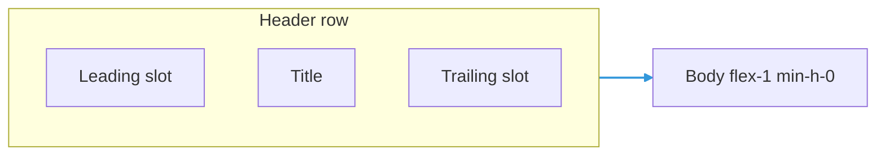

# TRNSectionContainer User Manual

`TRNSectionContainer` is a bordered **section** with an optional **toolbar-style header** (leading icon, title, trailing actions) and a **scroll-friendly body** for nested panels and lists.

---

## 1) Overview

Use it when you need:

- a titled block inside a larger window or column
- **icons or counts** beside the title without custom header markup
- **trailing controls** (refresh, badges) aligned to the end of the header row
- optional **glass** styling consistent with `TRNCard` presets

---

## 2) Quick Start

```tsx
import { ListTree, RefreshCw } from "lucide-react";
import { TRNSectionContainer } from "../TRNSectionContainer.js";

export function PortsSection() {
  return (
    <TRNSectionContainer
      title="Detected ports"
      titleLeadingSlot={<ListTree className="h-3.5 w-3.5 text-cyan-300/85" aria-hidden />}
      headerTitleClassName="normal-case tracking-normal text-zinc-100"
      titleTrailingSlot={
        <div className="inline-flex items-center gap-1.5">
          <span className="text-xs text-zinc-400">7 found</span>
          <button type="button" aria-label="Refresh">
            <RefreshCw className="h-3.5 w-3.5" />
          </button>
        </div>
      }
      className="min-h-0 flex-1"
      glass={false}
    >
      <p className="text-xs text-zinc-300">Body content…</p>
    </TRNSectionContainer>
  );
}
```

---

## 3) Props Reference

| Prop | Type | Default | Description |
|------|------|---------|-------------|
| `title` | `string` | required | Section title |
| `titleLeadingSlot` | `ReactNode` | `undefined` | Node before title (icon, badge) |
| `titleTrailingSlot` | `ReactNode` | `undefined` | Node after title, end-aligned |
| `headerTitleClassName` | `string` | `undefined` | Extra classes on title `span` (merged with `twMerge`); use to drop uppercase or tune typography |
| `children` | `ReactNode` | `undefined` | Body |
| `className` | `string` | `undefined` | Extra classes on outer `<section>` (merged with `twMerge`) |
| `glass` | `boolean` | `false` | Use translucent shell styling |
| `glassPreset` | `"soft" \| "medium" \| "strong"` | `"medium"` | Glass look when `glass` is true |

---

## 4) Header modes

If **any** of `titleLeadingSlot`, `titleTrailingSlot`, or `headerTitleClassName` is set, the header renders as a **single row**: leading slot, truncated title, trailing slot.

If **none** of those are set, a **simple caption** header is used (title only, default uppercase caption style).

---

## 5) Layout notes

- Outer `<section>` uses `flex h-full min-h-0 flex-col` so it can sit inside flex parents and participate in height constraints.
- Body is wrapped in `min-h-0 flex-1` so scrollable children can shrink correctly inside nested flex layouts.

---

## 6) Related

- [TRNWindow User Manual](./TRNWindow.md) — floating windows that often embed sections
- [TRNContainer User Manual](./TRNContainer.md) — page-level layout


