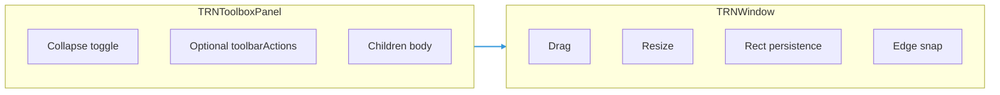

# TRNToolboxPanel User Manual

Specialized floating shell for **3D viewport overlays** (telemetry, scene tools, filters). It composes [`TRNWindow`](./TRNWindow.md) with opinionated defaults so generic windows stay simple while toolbox UX can evolve independently.

## Goals

- Same core behaviors as `TRNWindow` where they matter for overlays: **portal + `boundsRef`**, **drag**, **resize**, **optional rect persistence**, **glass** styling.
- **No maximize** — not exposed on this component API.
- **Collapse / expand** — reduce vertical footprint when multiple toolboxes are open.
- **Edge snap** — optional magnetic attach to the **left or right** bounds edge while dragging.
- **Higher transparency** — default glass preset tuned so the **3D scene** remains visible behind the panel.

## Architecture

- **`TRNToolboxPanel`**: collapse state, storage for collapsed flag, default props, integrates **collapse control** into the window header (via `headerActions` on `TRNWindow`).
- **`TRNWindow`**: owns geometry, pointer handlers, and optional **`dragEdgeSnapPx`** so snap stays numerically correct relative to `boundsRef` / viewport size.

## Feature Matrix

| Capability | TRNWindow | TRNToolboxPanel |
|------------|-----------|-----------------|
| Maximize | optional (`showMaximize`) | **omitted** |
| Collapse | — | **yes** |
| Default `modal` | often `true` | **`false`** (non-blocking overlay) |
| Default glass | user choice | **`true`**, preset **`toolbox`** (more transparent) |
| Edge snap while drag | optional `dragEdgeSnapPx` | **default enabled** (pixels configurable) |
| Pin glass | — | **toggle** (opaque readability vs transparent scene); optional **`persistPinOpaque`** |
| Escape to collapse | — | optional **`collapseOnEscape`** (focus must be inside shell) |

## Collapse Behavior

- **Expanded**: full `children` visible; `minHeight` follows props (default **120** when expanded).
- **Collapsed**: **body hidden**; shell shows **title bar only**. **`minHeight`** is reduced to match the header (~**36px**). **`resizable`** is turned **off** while collapsed so the shell stays a compact bar.
- **Best with `heightMode="auto"`** (default on the panel). With **`heightMode="fixed"`**, collapsing may not shrink the shell height because geometry is driven by `rect.height`; prefer auto for toolbox content.

## Persistence

- When **`persistRectStorageKey`** is set and **`persistCollapsed`** is **true** (default), the collapsed flag is stored under:

  `"{persistRectStorageKey}:collapsed"`

  as `"true"` / `"false"`.

- Rect persistence continues to use the base key (same as `TRNWindow`).

## Edge Snap

- While dragging, within **`dragEdgeSnapPx`** pixels of the bounds box:
  - **Left / right:** **x** snaps so the panel side is flush with the overlay (`x = 0` or `x = viewportWidth − width`).
  - **Bottom:** **y** snaps so the panel **bottom** is flush with the overlay bottom (`y = viewportHeight − height`).
- Set **`dragEdgeSnapPx={0}`** on `TRNToolboxPanel` (or pass through to `TRNWindow`) to disable.

## Pin glass (readability)

- Header **pin** toggles a **more opaque** glass recipe (constants **`TRN_TOOLBOX_PIN_GLASS_*`**) so dense telemetry stays readable; toggling off restores the default **`toolbox`** preset transparency for seeing the 3D scene.
- When **`persistRectStorageKey`** is set and **`persistPinOpaque`** is **true** (default), pin state is stored under `"{persistRectStorageKey}:pinOpaque"`.
- Set **`pinControl="off"`** to hide the pin button and keep the default transparent preset only.

## Escape to collapse

- When **`collapseOnEscape`** is **true** (default), a **capture-phase** `keydown` listener collapses the panel if **Escape** is pressed while **focus** is inside the panel shell (including children). Focus must be in the panel (click or tab); it does not collapse when focus is elsewhere (e.g. the canvas only).
- Set **`collapseOnEscape={false}`** to disable. The shell receives **`tabIndex={-1}`** when escape handling is enabled so the panel can be focused for keyboard tests.

## `TRNWindow` passthrough

- **`shellProps`** / **`shellRef`** — forwarded to `TRNWindow` for tests or extra attributes (see [TRNWindow](./TRNWindow.md) `shellProps`, `shellRef`).

## Public API

Import from the TRN barrel (`@/ui/TRN` or `@/ui/TRN/index.js`):

- **`TRNToolboxPanel`** — component.
- **`TRNToolboxPanelProps`** — props type (`Omit<TRNWindowProps, "showMaximize" | "headerActions">` plus collapse, toolbar, pin, escape).
- **`TRN_TOOLBOX_PIN_GLASS_OPACITY`**, **`TRN_TOOLBOX_PIN_GLASS_BORDER_OPACITY`**, **`TRN_TOOLBOX_PIN_GLASS_BLUR_PX`** — pin-mode glass tuning.

Re-exported **`TRNWindow`** utilities (`normalizeRect`, `TRNWindowRect`, …) are unchanged.

## Examples

- Registry: **`TRN_TOOLBOX_PANEL_EXAMPLE_TABS`** in `examples/exampleRegistry.ts`.
- Demo UI: **`examples/TRNToolboxPanelExample.tsx`** (bounded fake viewport + copy for pin / Esc).
- Example Catalog (`Ctrl/Cmd+K`) includes group filter **TRNToolboxPanel**.

## Implementation Todo List (project maintenance)

Use this list when extending or auditing the implementation.

- [x] Document goals, collapse, snap, persistence, and `heightMode` caveats (this file).
- [x] Add **`headerActions`** and **`dragEdgeSnapPx`** to `TRNWindow`; add **`toolbox`** glass preset.
- [x] Implement **`TRNToolboxPanel`** (collapse, defaults, optional `toolbarActions`).
- [x] Export from **`index.ts`**.
- [x] Migrate at least one overlay consumer (e.g. viewport telemetry HUD) to **`TRNToolboxPanel`**.
- [x] Example catalog entries + **`TRNToolboxPanelExample`** (`exampleRegistry.ts`).
- [x] **`Esc`** collapses when focus is inside the shell (**`collapseOnEscape`**).
- [x] **Pin** toggles opaque vs transparent glass (**`pinControl`**, persisted **`pinOpaque`**).

## Related

- [TRNWindow User Manual](./TRNWindow.md)
- [README index](./README.md)
