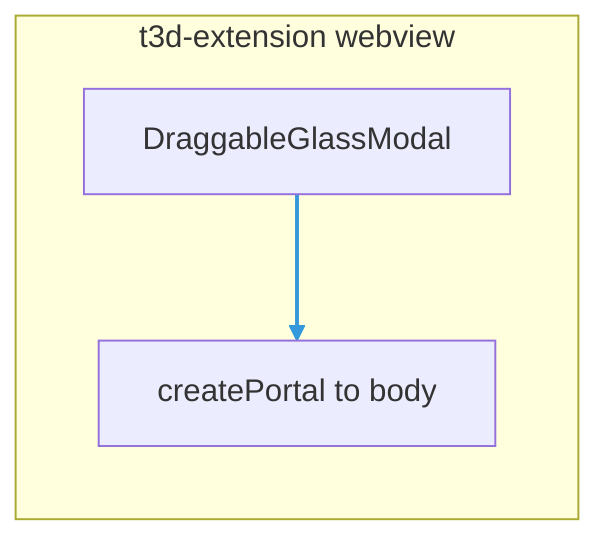

# DraggableGlassModal

Draggable, **resizable** glassmorphism modal for the extension webview. Content is rendered in a **portal** to `document.body`, so it is not clipped by parent overflow and stacks above most in-app UI.

## Under the hood

Implementation lives in **`ui/components/draggable-glass-modal/`** (portal to `document.body`, centered open layout, drag + resize). Subcomponents include **`GlassModalTitleBar`**, **`GlassModalBody`**, **`GlassModalResizeHandles`**, plus **`useGlassModalLayout`**.



## When to use

- Floating tools (serial monitor, debug panels) that should match the **dark glass** look.
- Any modal that must be **moved** and **resized** without embedding custom pointer logic.

## When not to use

- Full-screen mandatory flows that should not float (use a full-view layout instead).
- If you only need a static card, use [`Card`](../Card.tsx) or a simple `div` with Tailwind.

## Import

```tsx
import { DraggableGlassModal } from "@/ui/components";
// or
import { DraggableGlassModal } from "../ui/components/draggable-glass-modal";
```

## Basic usage

```tsx
import { Wrench } from "lucide-react";
import { DraggableGlassModal } from "@/ui/components";

export function MyTool() {
  return (
    <DraggableGlassModal
      panelId="my-tool"
      title="My tool"
      description="Optional subtitle shown under the header strip."
      icon={Wrench}
      initialWidth={720}
      initialHeight={480}
      minWidth={360}
      minHeight={280}
    >
      <div className="text-sm text-white/80">Modal body (scroll inside if needed).</div>
    </DraggableGlassModal>
  );
}
```

### Close button

Pass **`onClose`** to show the header close (X) control. If omitted, no close button is shown.

```tsx
<DraggableGlassModal title="Closable" onClose={() => setOpen(false)}>
  …
</DraggableGlassModal>
```

## Props (summary)

| Prop | Type | Default | Notes |
|------|------|---------|--------|
| `title` | `string` | required | Shown in the draggable header |
| `description` | `string` | optional | Shown inside the body, below header, with divider |
| `icon` | `LucideIcon` | optional | Icon next to title |
| `children` | `ReactNode` | required | Main content; use `min-h-0 flex-1` children for scroll regions |
| `onClose` | `() => void` | optional | Enables close button |
| `initialWidth` | `number` | `896` | CSS px |
| `initialHeight` | `number` | `620` | CSS px |
| `minWidth` | `number` | `400` | |
| `minHeight` | `number` | `320` | |
| `maxWidth` | `number` | optional | Defaults to ~95% of viewport width |
| `maxHeight` | `number` | optional | Defaults to ~90% of viewport height |
| `className` | `string` | optional | Merged with default glass classes via `twMerge` |
| `panelId` | `string` | optional | Useful if you track multiple modals |
| `onPositionChange` | `(pos: { x: number; y: number }) => void` | optional | Fired when the modal moves |
| `onSizeChange` | `(size: { width: number; height: number }) => void` | optional | Fired while resizing |

Full TypeScript types: `DraggableGlassModalProps`, `Point2D`, `ResizeHandleKind` in
[`draggable-glass-modal/`](../draggable-glass-modal/).

## Interaction

- **Drag:** grab the **title bar** (not the content area).
- **Resize:** hover any edge or corner; eight handles (full compass + diagonals).
- **Z-order:** modal uses `z-50` on the shell; raise z-index in `className` if something must stack above.

## Styling notes

- Default glass classes use **`!`** modifiers where needed to win over other utilities.
- Override or extend with **`className`**; use Tailwind utilities compatible with the webview build.
- Body inset is controlled via **`glass-modal-constants.ts`** (pixel values per `bodyDensity`).

## Reference implementation

The Serial Monitor quick scene uses this modal:

- [`quick-scene/qs-serial-monitor/ui/AppQsSerialMonitor.tsx`](../../../quick-scene/qs-serial-monitor/ui/AppQsSerialMonitor.tsx)

## See also

- Source: [`../draggable-glass-modal/`](../draggable-glass-modal/) (hook, subcomponents, styles)
