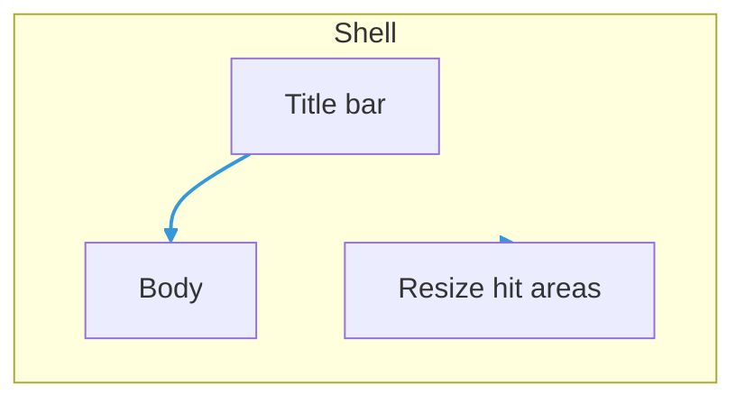

# draggable-glass-modal

Floating, **draggable** and **resizable** glass modal for the extension webview. Renders with **`createPortal`** to `document.body` so it is not clipped by parent overflow and stacks above most UI.

## Layout



| Part | Role |
|------|------|
| **Shell** | Fixed position, size, pointer handlers for drag and resize. |
| **Title bar** | Drag handle; optional **menu** (`onMenuClick` + `menuIcon`), **title** + optional **lead `icon`**, optional **close** (`onClose` + `closeIcon`). Menu and close use `data-drag-handle="false"`. |
| **Body** | Optional `description` subtitle, then `children`. Not a drag handle. |
| **Resize** | All four edges and four corners (compass `n`/`e`/`s`/`w` + diagonals); opposite edge stays fixed. `data-drag-handle="false"`. |

## Visual language

- **Translucent dark zinc** — layered gradients with low alpha so the 3D view shows through; **`backdrop-blur-2xl`** for glass read.
- **No outer border** — `border-0`; depth from soft shadow only.
- **Title** — `font-medium`, `text-zinc-100` (see `glass-modal-styles.ts` `titleTextClass`).
- **Header strip** — light `bg-zinc-950/25`, no bottom rule (content separation is optional in body / description).

Shared classes live in **`glass-modal-styles.ts`**. Placement math (centered open, drag clamp) is in **`glass-modal-geometry.ts`**.

## Module map

| File | Responsibility |
|------|------------------|
| `DraggableGlassModal.tsx` | Portal + compose shell, header, body, resize. |
| `GlassModalTitleBar.tsx` | Header row and icon buttons. |
| `GlassModalBody.tsx` | Padded column, description slot, main slot. |
| `GlassModalDescription.tsx` | Subtitle line under header. |
| `GlassModalResizeHandles.tsx` | Invisible resize targets. |
| `useGlassModalLayout.ts` | Position, size, drag, resize, mount. |
| `types.ts` | `DraggableGlassModalProps`, `Point2D`, `ResizeHandleKind`. |
| `index.ts` | Public exports. |

## Interaction

- **Drag** — pointer down on the **title bar** only (not on menu, close, or body).
- **Resize** — drag shell edges or corner; size is clamped to min/max and optional viewport caps.
- **Move cursor** — `cursor-move` on title bar when not dragging; `cursor-grabbing` on shell while dragging.

## Imports

```ts
import {
  DraggableGlassModal,
  type DraggableGlassModalProps,
  type Point2D,
} from "../draggable-glass-modal";
```

Human-oriented API notes: [`../doc/DraggableGlassModal.md`](../doc/DraggableGlassModal.md).
